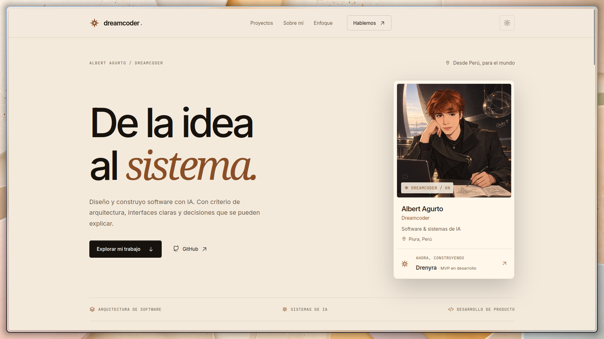

<div align="center">

# DreamFolio

Portafolio público de Dreamcoder08 — arquitectura frontend static-first con Astro, construido para mostrar el ecosistema ARKELYTHEX con velocidad y accesibilidad de primer nivel.

[]()
[](https://dreamcoder08.github.io/DreamFolio)

</div>

---

## Demo



## Índice

- [Descripción](#descripción)
- [Características](#características)
- [Stack técnico](#stack-técnico)
- [Instalación](#instalación)
- [Uso](#uso)
- [Estructura del proyecto](#estructura-del-proyecto)
- [Despliegue](#despliegue)
- [Licencia](#licencia)

## Descripción

DreamFolio es el portafolio público de Dreamcoder08: una superficie de evidencia para mostrar arquitectura frontend, accesibilidad y la narrativa técnica detrás del ecosistema fiscal ARKELYTHEX. Astro renderiza el sitio como HTML estático por defecto, y React solo hidrata los componentes que realmente necesitan estado o interacción en el cliente.

## Características

- **Arquitectura static-first** — Astro genera HTML estático; React hidrata solo donde el navegador necesita manejar estado o comportamiento real.
- **Islas hidratadas selectivas** — `Navbar` (menú móvil), `EnhancedHero` (selector de señales), `EvidenceEngine` (inspección de evidencia/presets) y `TechnicalIntake` (validación local, portapapeles y generación de borrador `mailto:`).
- **Diseño accesible** — sistema de marca "Cocoa" (Cocoa `#B97A45`, Cream `#EFE4D7`, Lúcuma `#D8A64A`) orientado a accesibilidad.
- **Despliegue automatizado** — CI/CD vía GitHub Actions a GitHub Pages, con typecheck (`astro check` + `tsc`) antes del build.

## Stack técnico

| Capa | Tecnología |
|------|-----------|
| Framework | Astro 5 (SSG, static-first, islands architecture) |
| Islas interactivas | React 19 |
| Estilos | Tailwind CSS 4 |
| Lenguaje | TypeScript (modo estricto) |
| Gestor de paquetes | pnpm |
| CI/CD | GitHub Actions → GitHub Pages |

## Instalación

```bash
git clone https://github.com/Dreamcoder08/DreamFolio.git
cd DreamFolio
pnpm install
```

## Uso

```bash
# desarrollo
pnpm dev

# build de producción + preview local
pnpm run build
pnpm run preview

# typecheck + build (quality gate usado en CI)
pnpm run verify
```

## Estructura del proyecto

```
DreamFolio/
├── src/
│   ├── components/
│   │   ├── sections/       # Secciones de landing (.astro estáticas, .tsx solo si hidratan)
│   │   └── ui/              # Primitivas React reutilizables
│   ├── content.config.ts    # Esquema tipado de la colección de proyectos
│   ├── data/                 # Datos públicos del sitio
│   ├── layouts/               # Layout base y SEO
│   ├── lib/                    # Helpers de presentación/sitio
│   ├── pages/                   # Rutas de Astro
│   └── styles/                   # Tema global Tailwind/Cocoa
├── docs/                           # Documentación del proyecto
└── public/                          # Assets estáticos
```

## Despliegue

El sitio se despliega automáticamente a GitHub Pages en cada push a `main`/`master` mediante `.github/workflows/deploy.yml` (instala con pnpm, corre typecheck, build y publica `dist/`). También incluye `vercel.json` para despliegue alternativo en Vercel.

<TODO: completar — no se encontraron variables de entorno realmente consumidas por el código actual en src/; el archivo .env.example en la raíz referencia Supabase y APIs de IA (OpenAI/Anthropic/Google) que parecen ser remanentes de una iteración anterior del proyecto y no están integradas en el código presente.>

## Licencia

<TODO: completar — no se encontró archivo LICENSE en el repositorio. Definir y agregar la licencia antes de publicitar el proyecto como open source.>
