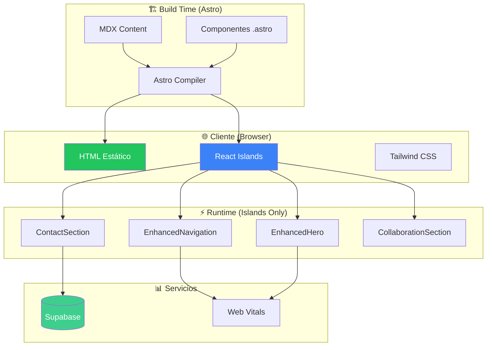

# 📚 Dreamfolio Astro - Documentación

<div align="center">


**Portafolio profesional construido con el Bleeding Edge Stack 2025**

[Ver Demo](https://dreamfolio-astro.vercel.app) · [Arquitectura](#-arquitectura) · [Componentes](#-componentes) · [Guías](#-guías)

</div>

---

## 🎯 Visión General

Este proyecto implementa un portafolio web de alto rendimiento utilizando **Astro** con la **Arquitectura de Islas (Islands Architecture)**, logrando tiempos de carga inferiores a 1 segundo y puntuaciones perfectas en Lighthouse.

### ¿Por qué Astro y no Next.js?

> Como Senior Software Engineer, mi enfoque para tomar esta decisión se basa en tres pilares: **Performance (Rendimiento), DX (Experiencia de Desarrollo) y Propósito**.

Un portafolio tiene un propósito muy diferente al de una aplicación SaaS. Su objetivo es **cargar instantáneamente**, tener un **SEO perfecto** y mostrar **contenido visual**.

---

## 📐 Diagrama de Arquitectura



---

## 📂 Estructura del Proyecto

```text
src/
├── components/           # UI Reutilizable
│   ├── EnhancedNavigation.tsx    # 🏝️ React Island
│   ├── sections/
│   │   ├── EnhancedHero.tsx      # 🏝️ React Island
│   │   ├── ContactSection.tsx     # 🏝️ React Island
│   │   ├── CollaborationSection.tsx # 🏝️ React Island
│   │   ├── TechSection.astro      # 📄 Static
│   │   └── TrinitySection.astro   # 📄 Static
│   └── ui/               # Componentes base
├── layouts/
│   └── BaseLayout.astro  # Template principal
├── lib/
│   ├── monitoring.ts     # Core Web Vitals
│   └── supabase/
│       └── client.ts     # Cliente Supabase
├── pages/
│   └── index.astro       # Página principal
└── styles/
    └── global.css        # Estilos globales
```

**Leyenda:**
- 🏝️ **React Island**: Componente hidratado (envía JavaScript)
- 📄 **Static**: Componente 100% HTML (cero JavaScript)

---

## 📖 Índice de Documentación

### 🏛️ Arquitectura
| Documento | Descripción |
|-----------|-------------|
| [Decisiones Arquitectónicas](./architecture/README.md) | Por qué Astro, Feature-First, Islands |
| [Next.js vs Astro](./architecture/stack-comparison.md) | Comparativa técnica detallada |
| [Islands Architecture](./architecture/islands-architecture.md) | Patrón de hidratación selectiva |

### 🧩 Componentes
| Documento | Descripción |
|-----------|-------------|
| [Catálogo de Componentes](./components/README.md) | Índice y clasificación |
| [EnhancedNavigation](./components/navigation.md) | Navegación con scroll handling |
| [EnhancedHero](./components/hero.md) | Hero animado con partículas |
| [ContactSection](./components/contact.md) | Formulario con validación Zod |
| [CollaborationSection](./components/collaboration.md) | Sección de colaboración |

### 📦 Utilidades
| Documento | Descripción |
|-----------|-------------|
| [Índice de Utilidades](./lib/README.md) | Servicios y helpers |
| [MonitoringService](./lib/monitoring.md) | Core Web Vitals tracking |
| [Supabase Client](./lib/supabase.md) | Cliente de base de datos |

### 📘 Guías
| Documento | Descripción |
|-----------|-------------|
| [Inicio Rápido](./guides/getting-started.md) | Configuración inicial |
| [Mejores Prácticas 2025](./guides/best-practices.md) | Golden Standard Stack |

---

## 🚀 Inicio Rápido

```bash
# Clonar repositorio
git clone https://github.com/dreamcoder08/dreamfolio-astro.git
cd dreamfolio-astro

# Instalar dependencias
pnpm install

# Configurar variables de entorno
cp .env.example .env

# Iniciar servidor de desarrollo
pnpm dev
```

---

## 📊 Métricas de Rendimiento

| Métrica | Objetivo | Estado |
|---------|----------|--------|
| **LCP** (Largest Contentful Paint) | < 2.5s | ✅ |
| **FID** (First Input Delay) | < 100ms | ✅ |
| **CLS** (Cumulative Layout Shift) | < 0.1 | ✅ |
| **TTFB** (Time to First Byte) | < 600ms | ✅ |
| **Lighthouse Performance** | 100/100 | 🎯 |

---

<div align="center">

**Construido con ❤️ por [Dreamcoder08](https://github.com/dreamcoder08)**

*Última actualización: Diciembre 2025*

</div>
