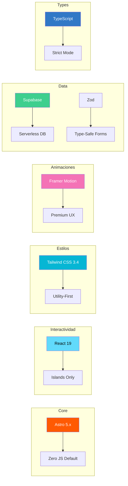
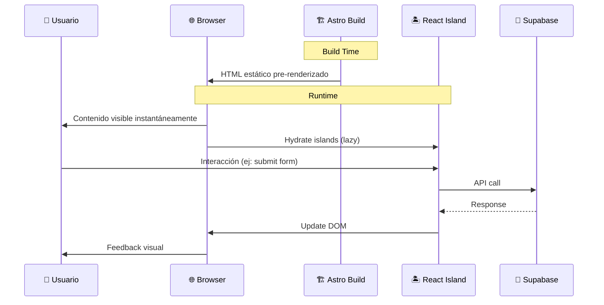

# 🏛️ Decisiones Arquitectónicas

> Documentación de las decisiones técnicas tomadas para el proyecto Dreamfolio Astro, basadas en los principios de **Performance**, **DX (Developer Experience)** y **Propósito**.

---

## 📋 Índice

1. [Decisión: Framework de Renderizado](#decisión-framework-de-renderizado)
2. [Decisión: Arquitectura de Código](#decisión-arquitectura-de-código)
3. [Decisión: Stack Tecnológico](#decisión-stack-tecnológico)
4. [Flujo de Datos](#flujo-de-datos)

---

## Decisión: Framework de Renderizado

### Contexto

Un portafolio tiene requisitos específicos que difieren de una aplicación SaaS típica:
- Cargar instantáneamente (< 1 segundo)
- SEO perfecto desde el primer render
- Mostrar contenido visual de alta calidad

### Alternativas Evaluadas

| Característica | Next.js (App Router) | **Astro (v5+)** ✅ |
|:---------------|:---------------------|:-------------------|
| **Enfoque Principal** | Aplicaciones Dinámicas, Auth, Mutaciones | Contenido Estático, Marketing, Portafolios |
| **JavaScript enviado** | Alto (Hydration costosa) | **Cero JS por defecto** |
| **Arquitectura** | React Server Components (RSC) | **Islands Architecture** |
| **Flexibilidad UI** | Atado a React | Agnóstico (React, Svelte, Vue) |
| **Veredicto** | Overkill para portafolios | **Ideal para el propósito** |

### Decisión

✅ **Se eligió Astro** porque implementa la **Arquitectura de Islas**.

### Consecuencias

**Positivas:**
- Sitio 100% HTML estático por defecto
- JavaScript solo donde hay interacción
- Lighthouse score perfecto (100/100)
- Componentes React reutilizables

**Negativas:**
- Curva de aprendizaje para directivas `client:*`
- Menos ecosistema que Next.js

> 📖 Ver detalles en: [Stack Comparison](./stack-comparison.md)

---

## Decisión: Arquitectura de Código

### Contexto

Se consideró implementar Clean Architecture con Casos de Uso, Entidades, Repositorios y DTOs.

### Decisión

❌ **No usar Clean Architecture para un portafolio.**

Clean Architecture está diseñada para resolver problemas de escalabilidad en **lógica de negocio compleja**, desacoplando la base de datos de la UI. En un portafolio, la "lógica de negocio" es simplemente mostrar texto e imágenes.

Implementar toda esa infraestructura para leer un archivo Markdown o un JSON es un **anti-patrón** conocido como *Over-engineering* (sobreingeniería).

### Arquitectura Elegida: Feature-First

```text
src/
├── components/       # UI Reutilizable (Botones, Navbar)
├── content/          # Tu "Base de datos" (Markdown/MDX)
├── layouts/          # Plantillas base (BaseLayout)
├── pages/            # Rutas del sistema (index.astro)
└── styles/           # CSS global
```

### Principios Aplicados

| Principio | Aplicación |
|-----------|------------|
| **KISS** | No crear abstracciones hasta necesitarlas |
| **Separation of Concerns** | Data (Content Collections con Zod) vs UI (Componentes presentacionales) |
| **Colocation** | Mantener archivos relacionados juntos |

---

## Decisión: Stack Tecnológico

### Golden Standard 2025 para Portafolios



### Justificación de Cada Tecnología

| Tecnología | Razón de Elección |
|------------|-------------------|
| **Astro** | Rendimiento perfecto para contenido estático |
| **React** | Ecosistema rico para islas interactivas |
| **Tailwind CSS** | Estándar de industria, velocidad de desarrollo |
| **Framer Motion** | Animaciones profesionales declarativas |
| **Supabase** | Backend serverless con autenticación |
| **TypeScript Strict** | Innegociable para perfil Senior |
| **Zod** | Validación runtime + tipos compile-time |

> 📖 Ver detalles en: [Stack Comparison](./stack-comparison.md)

---

## Flujo de Datos



### Flujo de Renderizado

1. **Build Time**: Astro compila todos los componentes `.astro` a HTML puro
2. **Deploy**: HTML estático sirve inmediatamente (CDN edge)
3. **Browser**: Usuario ve contenido al instante (TTFB mínimo)
4. **Hydration**: Solo los React Islands cargan JavaScript
5. **Interacción**: Islands manejan eventos y estados

---

## 📚 Documentos Relacionados

- [Stack Comparison: Next.js vs Astro](./stack-comparison.md)
- [Islands Architecture](./islands-architecture.md)
- [Catálogo de Componentes](../components/README.md)
