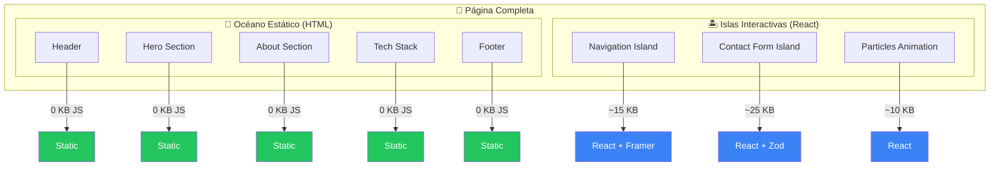
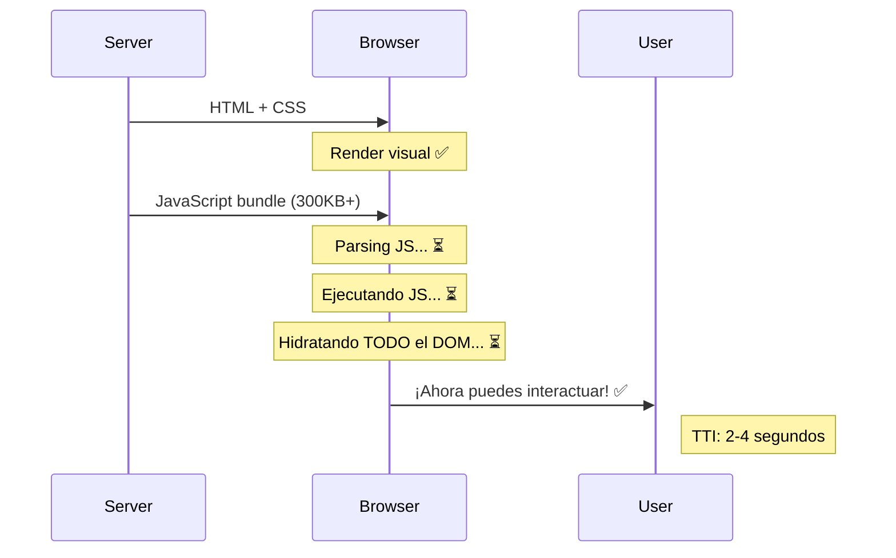
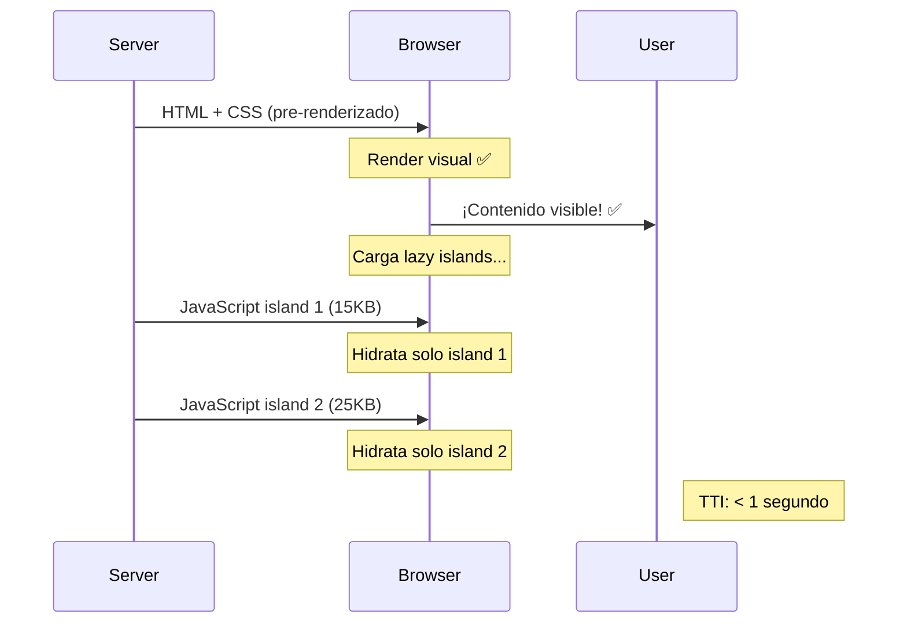
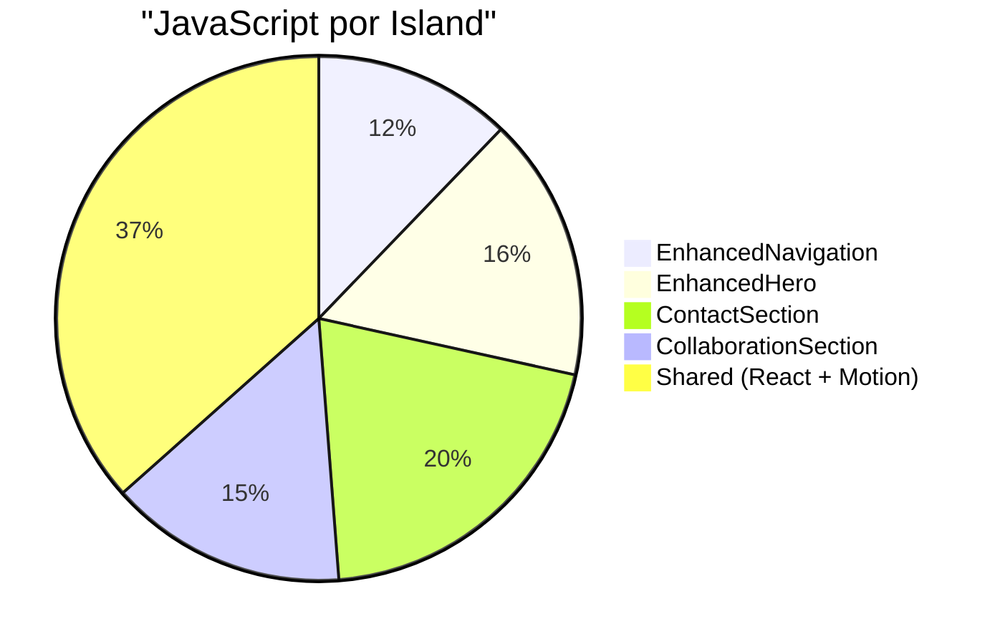

# 🏝️ Islands Architecture

> La arquitectura que hace que Astro sea perfecto para portafolios: **Zero JavaScript por defecto, hidratación selectiva.**

---

## 🎯 Concepto Central

Islands Architecture es un patrón de renderizado donde la página es principalmente **HTML estático** con "islas" de interactividad que se hidratan independientemente.



---

## 🆚 Comparación con Hidratación Tradicional

### Hidratación Tradicional (Next.js, CRA)



### Islands Architecture (Astro)



---

## 🔧 Implementación en Dreamfolio

### Componentes Estáticos (`.astro`)

Estos componentes se renderizan a **HTML puro** en build time:

```astro
---
// src/components/sections/TechSection.astro
// ✅ 0 KB JavaScript enviado al browser
const technologies = [
  { name: 'React', icon: '⚛️' },
  { name: 'TypeScript', icon: '📘' },
  { name: 'Astro', icon: '🚀' },
];
---

<section id="tech" class="py-20">
  <h2>Tech Stack</h2>
  <div class="grid grid-cols-3 gap-4">
    {technologies.map(tech => (
      <div class="tech-card">
        <span>{tech.icon}</span>
        <span>{tech.name}</span>
      </div>
    ))}
  </div>
</section>
```

### Componentes Island (`.tsx` con directiva `client:*`)

Estos componentes se hidratan en el browser:

```astro
---
// src/pages/index.astro
import BaseLayout from '../layouts/BaseLayout.astro';

// Componentes estáticos
import TechSection from '../components/sections/TechSection.astro';
import TrinitySection from '../components/sections/TrinitySection.astro';

// Islands - Solo estos envían JavaScript
import EnhancedNavigation from '../components/EnhancedNavigation';
import EnhancedHeroSection from '../components/sections/EnhancedHero';
import ContactSection from '../components/sections/ContactSection';
---

<BaseLayout>
  <!-- 🏝️ Island: Navegación con scroll handling -->
  <EnhancedNavigation client:load />
  
  <!-- 🏝️ Island: Hero con animaciones Framer Motion -->
  <EnhancedHeroSection client:load />
  
  <!-- 📄 Static: Sin JavaScript -->
  <TrinitySection />
  <TechSection />
  
  <!-- 🏝️ Island: Formulario con validación -->
  <ContactSection client:visible />
</BaseLayout>
```

---

## 📋 Directivas de Hidratación

| Directiva | Descripción | Uso en Dreamfolio |
|-----------|-------------|-------------------|
| `client:load` | Hidrata inmediatamente al cargar | `EnhancedNavigation`, `EnhancedHero` |
| `client:idle` | Hidrata cuando browser está idle | - |
| `client:visible` | Hidrata cuando entra en viewport | `ContactSection` |
| `client:media` | Hidrata según media query | - |
| `client:only="react"` | Solo cliente, sin SSR | Componentes con `window` |

### Ejemplo de Cada Directiva

```astro
<!-- Carga inmediata (navegación siempre necesaria) -->
<Navigation client:load />

<!-- Carga cuando el usuario no está interactuando -->
<Analytics client:idle />

<!-- Carga cuando el usuario hace scroll hasta aquí -->
<ContactForm client:visible />

<!-- Solo carga en mobile -->
<MobileMenu client:media="(max-width: 768px)" />

<!-- Solo en cliente, necesita window/document -->
<ThreeJSCanvas client:only="react" />
```

---

## 📊 Impacto en Performance

### Bundle Size por Componente



### Comparación Total

| Approach | JS Bundle | TTI |
|----------|-----------|-----|
| Todo React (SPA) | ~350 KB | 3-4s |
| Next.js RSC | ~180 KB | 1.5-2s |
| **Astro Islands** | **~80 KB** | **< 1s** |

---

## ✅ Edge Cases Cubiertos

| Edge Case | Solución |
|-----------|----------|
| **SSR sin window** | Usar `client:only="react"` para componentes que necesitan `window` |
| **Flicker en hidratación** | CSS crítico inline + `visibility: hidden` hasta hidratar |
| **SEO de contenido dinámico** | Renderizar estado inicial en servidor |
| **Lazy loading de islands** | `client:visible` para below-the-fold |
| **Multiple frameworks** | Cada island puede ser React, Svelte, o Vue |
| **State compartido** | `nanostores` para estado cross-island |

---

## 🔗 Comunicación entre Islands

Si necesitas compartir estado entre islands, usa una librería de estado agnóstica:

```typescript
// src/stores/theme.ts
import { atom } from 'nanostores';

export const isDarkMode = atom(false);

export function toggleTheme() {
  isDarkMode.set(!isDarkMode.get());
}
```

```tsx
// Cualquier island puede usar el store
import { useStore } from '@nanostores/react';
import { isDarkMode, toggleTheme } from '../stores/theme';

export function ThemeToggle() {
  const dark = useStore(isDarkMode);
  return (
    <button onClick={toggleTheme}>
      {dark ? '🌙' : '☀️'}
    </button>
  );
}
```

---

## 📚 Referencias

- [Islands Architecture - Jason Miller](https://jasonformat.com/islands-architecture/)
- [Astro Partial Hydration](https://docs.astro.build/en/concepts/islands/)
- [Patterns.dev - Islands Architecture](https://www.patterns.dev/posts/islands-architecture)
