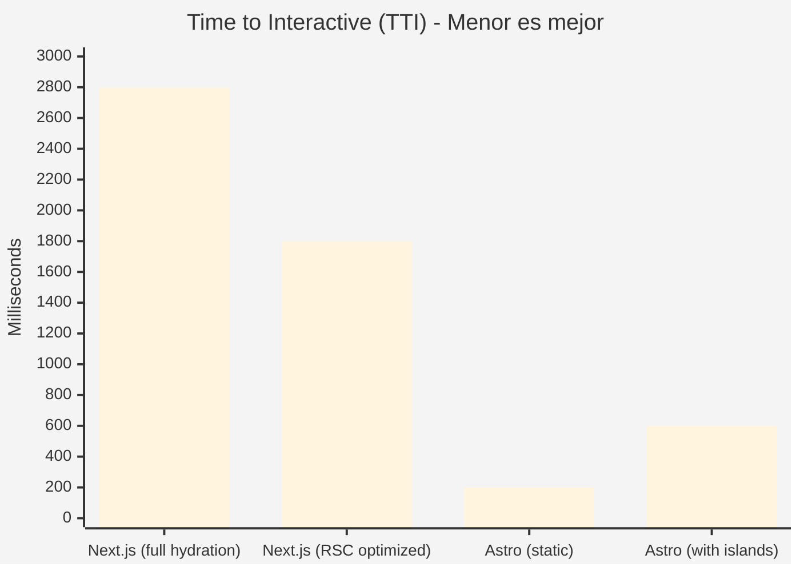
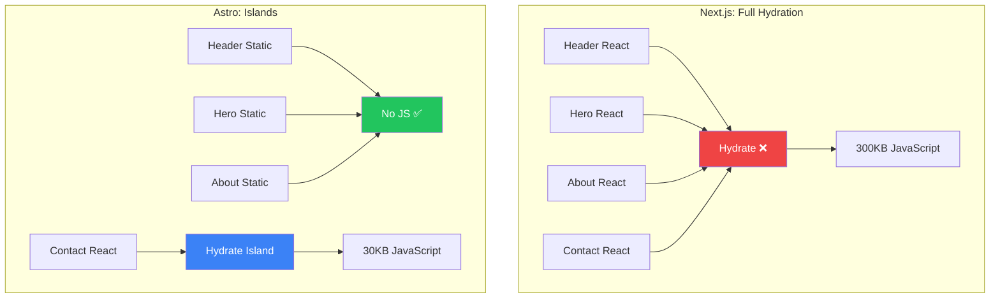
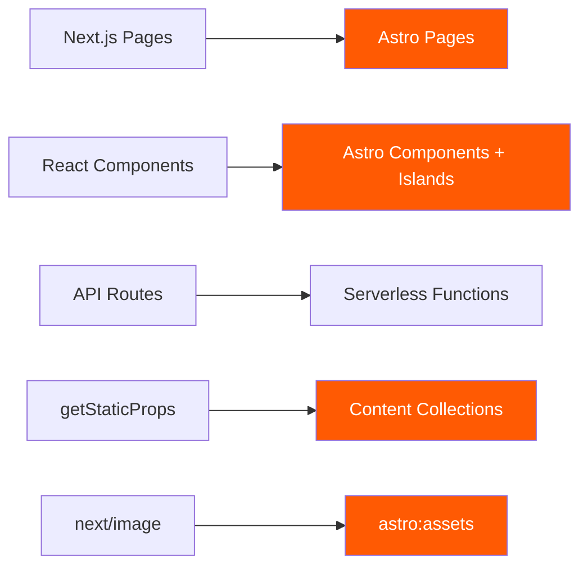

# ⚔️ Stack Comparison: Next.js vs Astro

> Análisis técnico detallado para la decisión de framework, actualizado a **2025**.

---

## 📊 Tabla Comparativa Completa

| Característica | Next.js (App Router) | Astro (v5+) | Ganador |
|:---------------|:---------------------|:------------|:--------|
| **Enfoque Principal** | Aplicaciones Dinámicas, Auth, Mutaciones de datos | Contenido Estático, Marketing, Blogs, Portafolios | Depende |
| **JavaScript enviado** | Alto (Hydration costosa). Todo es React por defecto. | **Cero JS por defecto**. Solo envía JS si hay interacción. | 🏝️ Astro |
| **Arquitectura** | React Server Components (RSC) | Islands Architecture (Arquitectura de Islas) | 🏝️ Astro |
| **Flexibilidad Framework** | Atado a React | Agnóstico (Usa React, Svelte, Vue o nada) | 🏝️ Astro |
| **Server-Side Rendering** | Excelente (streaming, suspense) | Bueno (SSR opcional) | ⚡ Next.js |
| **API Routes** | Excelente (Route Handlers) | Limitado (endpoints estáticos) | ⚡ Next.js |
| **Autenticación** | NextAuth integrado | Requiere integración manual | ⚡ Next.js |
| **Base de Datos** | Prisma, Drizzle integrados | Sin opinión (serverless) | ⚡ Next.js |
| **Build Time** | Moderado | **Muy rápido** | 🏝️ Astro |
| **Bundle Size** | Pesado por defecto | **Mínimo** | 🏝️ Astro |
| **Lighthouse Score** | 85-95 típico | **100/100 fácil** | 🏝️ Astro |

---

## 🎯 Cuándo Usar Cada Uno

### Usa Next.js cuando:
- ✅ Necesitas autenticación de usuarios (login, dashboard privado)
- ✅ Tu app tiene mutaciones de datos frecuentes
- ✅ Requieres API routes complejas
- ✅ Necesitas Server Components con data fetching real-time
- ✅ El sitio es una **aplicación web compleja**

### Usa Astro cuando:
- ✅ El sitio es principalmente **contenido estático**
- ✅ SEO es prioridad absoluta
- ✅ Performance es crítico (< 1s load time)
- ✅ Quieres usar múltiples frameworks UI
- ✅ Es un **portafolio, blog, marketing site o documentación**

---

## 📈 Benchmark de Performance



### Métricas Típicas

| Métrica | Next.js App Router | Astro Static | Astro + Islands |
|---------|-------------------|--------------|-----------------|
| **TTI** | 2.5-4s | < 0.5s | 0.5-1s |
| **FCP** | 1.5-2.5s | < 0.5s | < 0.5s |
| **LCP** | 2-3s | < 1s | < 1.5s |
| **JS Bundle** | 150-400KB | 0KB | 20-80KB |

---

## 🏝️ La Ventaja de Islands Architecture



### El Concepto

En Astro, puedes tener tu sitio **100% HTML estático** (lo que lo hace "volar") y solo "hidratar" (cargar JS) en componentes específicos llamados "islas":

```astro
---
// Esta página NO envía JavaScript
import Header from '../components/Header.astro'
import Hero from '../components/Hero.astro'
import About from '../components/About.astro'

// Solo este componente envía JavaScript
import ContactForm from '../components/ContactForm.jsx'
---

<Header />      <!-- Static HTML -->
<Hero />        <!-- Static HTML -->
<About />       <!-- Static HTML -->

<!-- Esta es la "isla" - solo esto carga React -->
<ContactForm client:visible />
```

### Directivas de Hidratación

| Directiva | Cuándo Hidrata | Uso Típico |
|-----------|----------------|------------|
| `client:load` | Inmediatamente | Navegación, elementos above-the-fold |
| `client:idle` | Cuando browser está idle | Widgets secundarios |
| `client:visible` | Cuando entra en viewport | Formularios, secciones below-the-fold |
| `client:media` | Cuando cumple media query | Componentes mobile-only |
| `client:only` | Solo en cliente (no SSR) | Componentes que usan `window` |

---

## 🥇 Golden Standard 2025 para Portafolios

| Capa | Tecnología | Alternativa |
|------|------------|-------------|
| **Core** | Astro | - |
| **Interactividad** | React o Preact | Svelte, Vue |
| **Estilos** | Tailwind CSS v4 | UnoCSS |
| **Contenido** | MDX | Content Collections |
| **Tipado** | TypeScript (Strict) | - |
| **Animaciones** | Motion (Framer Motion) | View Transitions API |
| **Validación** | Zod | Valibot |

### Nota sobre TypeScript

> **Esto es innegociable para un perfil Senior.** Define interfaces para tus proyectos y experiencia laboral.

```typescript
// src/types/project.ts
interface Project {
  id: string;
  title: string;
  description: string;
  technologies: string[];
  liveUrl?: string;
  githubUrl?: string;
  featured: boolean;
}
```

---

## 🔄 Migración de Next.js a Astro

Si ya tienes un portafolio en Next.js y quieres migrar:



### Pasos de Migración

1. **Páginas**: `.tsx` → `.astro` (mantener React como islands)
2. **Componentes estáticos**: Convertir a `.astro`
3. **Componentes interactivos**: Mantener como `.tsx` con `client:*`
4. **Data fetching**: `getStaticProps` → Content Collections
5. **Imágenes**: `next/image` → `astro:assets`

---

## 📚 Referencias

- [Astro Documentation](https://docs.astro.build)
- [Islands Architecture - Patterns.dev](https://www.patterns.dev/posts/islands-architecture)
- [Next.js Documentation](https://nextjs.org/docs)
- [Web Vitals](https://web.dev/vitals/)
