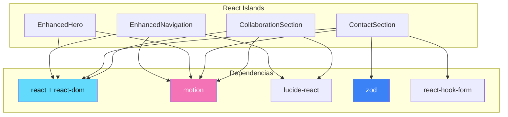
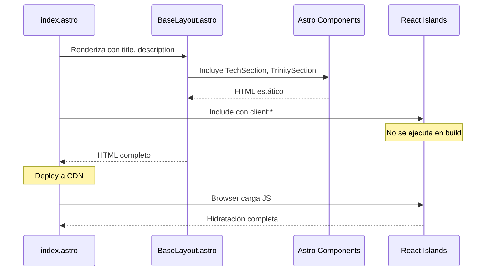

# 🧩 Catálogo de Componentes

> Índice completo de todos los componentes del proyecto Dreamfolio Astro, clasificados por tipo y estrategia de hidratación.

---

## 📋 Resumen

| Tipo | Cantidad | JavaScript |
|------|----------|------------|
| **React Islands** 🏝️ | 4 | ~80 KB total |
| **Astro Static** 📄 | 3 | 0 KB |
| **Total** | 7 | ~80 KB |

---

## 🏝️ React Islands (Componentes Hidratados)

Estos componentes envían JavaScript al browser y se hidratan para interactividad.

| Componente | Archivo | Directiva | Bundle Est. | Documentación |
|------------|---------|-----------|-------------|---------------|
| **EnhancedNavigation** | `components/EnhancedNavigation.tsx` | `client:load` | ~15 KB | [📖](./navigation.md) |
| **EnhancedHero** | `components/sections/EnhancedHero.tsx` | `client:load` | ~20 KB | [📖](./hero.md) |
| **ContactSection** | `components/sections/ContactSection.tsx` | `client:visible` | ~25 KB | [📖](./contact.md) |
| **CollaborationSection** | `components/sections/CollaborationSection.tsx` | `client:load` | ~18 KB | [📖](./collaboration.md) |

### Dependencias Compartidas



---

## 📄 Astro Static (Componentes Sin JavaScript)

Estos componentes se renderizan a HTML puro en build time.

| Componente | Archivo | Props | Descripción |
|------------|---------|-------|-------------|
| **BaseLayout** | `layouts/BaseLayout.astro` | `title`, `description` | Layout principal con SEO |
| **TechSection** | `sections/TechSection.astro` | - | Grid de tecnologías |
| **TrinitySection** | `sections/TrinitySection.astro` | - | Sección de metodología/filosofía |

---

## 🎨 Convenciones de Componentes

### Naming Convention

```text
EnhancedNavigation.tsx    ✅ PascalCase para React
ContactSection.tsx        ✅ Sufijo descriptivo
TechSection.astro         ✅ .astro para componentes estáticos
BaseLayout.astro          ✅ Layout en /layouts
```

### Estructura de Archivos

```text
components/
├── EnhancedNavigation.tsx    # Componente standalone
├── sections/                  # Secciones de página
│   ├── EnhancedHero.tsx
│   ├── ContactSection.tsx
│   ├── CollaborationSection.tsx
│   ├── TechSection.astro
│   └── TrinitySection.astro
└── ui/                        # Componentes base reutilizables
    └── Button.tsx
    └── Card.tsx
```

---

## 📐 Flujo de Renderizado



---

## ✅ Props y Tipos

### React Components

```typescript
// EnhancedNavigation - Sin props externas
interface EnhancedNavigationProps {
  // Usa estado interno
}

// ContactSection - Sin props externas
interface ContactFormData {
  name: string;
  email: string;
  message: string;
}

// EnhancedHero - Sin props externas
interface FloatingParticle {
  id: number;
  x: number;
  y: number;
  delay: number;
}
```

### Astro Components

```typescript
// BaseLayout.astro
interface Props {
  title?: string;
  description?: string;
}

// TechSection.astro - Sin props
// TrinitySection.astro - Sin props
```

---

## 🔍 Búsqueda Rápida

| Necesito... | Usar |
|-------------|------|
| Navegación sticky con scroll handling | `EnhancedNavigation` |
| Hero con animaciones y partículas | `EnhancedHero` |
| Formulario de contacto validado | `ContactSection` |
| Mostrar colaboración/CTA | `CollaborationSection` |
| Grid de tecnologías estático | `TechSection` |
| Layout base con SEO | `BaseLayout` |

---

## 📚 Documentación Detallada

- [EnhancedNavigation](./navigation.md) - Navegación con scroll y mobile menu
- [EnhancedHero](./hero.md) - Hero animado con partículas flotantes
- [ContactSection](./contact.md) - Formulario con validación Zod + Supabase
- [CollaborationSection](./collaboration.md) - Sección de llamada a la acción
