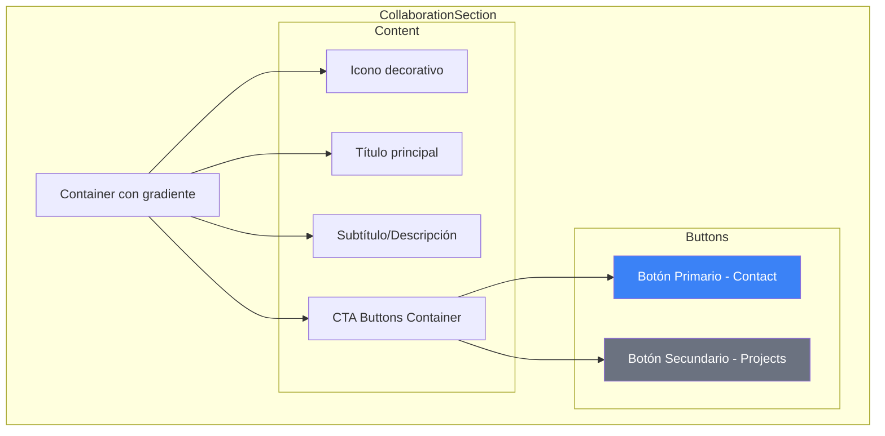

# 🤝 CollaborationSection Component

> Sección de llamada a la acción para colaboración y trabajo conjunto.

**Ubicación:** `src/components/sections/CollaborationSection.tsx`  
**Tipo:** 🏝️ React Island  
**Directiva:** `client:load`  
**Bundle:** ~18 KB

---

## 📋 Descripción

`CollaborationSection` es una sección CTA (Call-to-Action) que invita a los visitantes a colaborar. Incluye:

- Texto persuasivo con animaciones de aparición
- Botones de acción con hover effects
- Iconos decorativos animados
- Layout responsive para todos los dispositivos

---

## 🔧 API Reference

### JSDoc Principal

```typescript
/**
 * Sección de llamada a la acción para colaboración.
 * Diseñada para captar la atención y convertir visitantes.
 * 
 * @component
 * @example
 * ```astro
 * ---
 * import CollaborationSection from '../components/sections/CollaborationSection';
 * ---
 * <CollaborationSection client:load />
 * ```
 * 
 * @returns {JSX.Element} Sección CTA animada
 * 
 * @description
 * Características:
 * - Título y subtítulo con entrada animada
 * - Botones CTA primario y secundario
 * - Iconos decorativos con animación flotante
 * - Fondo con gradiente sutil
 * - Tracking de clicks para analytics
 */
function CollaborationSection(): JSX.Element
```

---

## 🏗️ Estructura Visual



---

## 🎨 Animaciones

### Entrada del Contenedor

```typescript
const containerVariants = {
  hidden: { opacity: 0, y: 30 },
  visible: {
    opacity: 1,
    y: 0,
    transition: {
      duration: 0.6,
      ease: "easeOut",
      staggerChildren: 0.2
    }
  }
};
```

### Iconos Flotantes

```typescript
const floatingIconVariants = {
  animate: {
    y: [0, -10, 0],
    rotate: [0, 5, -5, 0],
    transition: {
      duration: 4,
      repeat: Infinity,
      ease: "easeInOut"
    }
  }
};
```

### Hover en Botones

```typescript
const buttonHover = {
  scale: 1.05,
  boxShadow: "0 10px 30px rgba(0,0,0,0.2)",
  transition: { duration: 0.2 }
};

const buttonTap = {
  scale: 0.98
};
```

---

## ✅ Edge Cases Cubiertos

| Edge Case | Solución |
|-----------|----------|
| **Viewport pequeño** | Stack vertical de botones en mobile |
| **Texto muy largo** | `line-clamp` o truncation |
| **Animación en viewport** | `viewport={{ once: true, amount: 0.3 }}` |
| **Reduced motion** | Respeta `prefers-reduced-motion` |
| **Click tracking** | `trackButtonClick` en cada CTA |

---

## 📦 Dependencias

```json
{
  "react": "^19.1.1",
  "motion": "^12.x",
  "lucide-react": "^0.559.0"
}
```

---

## 📖 Ejemplo de Uso

```astro
---
import CollaborationSection from '../components/sections/CollaborationSection';
---

<section id="collaboration">
  <CollaborationSection client:load />
</section>
```
