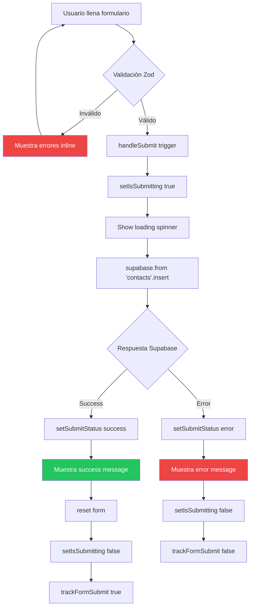

# 📬 ContactSection Component

> Formulario de contacto con validación Zod, React Hook Form y envío a Supabase.

**Ubicación:** `src/components/sections/ContactSection.tsx`  
**Tipo:** 🏝️ React Island  
**Directiva:** `client:visible`  
**Bundle:** ~25 KB

---

## 📋 Descripción

`ContactSection` implementa un formulario de contacto profesional con:

- Validación en tiempo real con Zod
- Gestión de formulario con React Hook Form
- Envío de datos a Supabase
- Estados de carga, éxito y error
- Animaciones de feedback con Framer Motion

---

## 🔧 API Reference

### JSDoc Principal

```typescript
/**
 * Formulario de contacto con validación y persistencia.
 * Usa Zod para validación, React Hook Form para gestión,
 * y Supabase para almacenamiento.
 * 
 * @component
 * @example
 * ```astro
 * ---
 * import ContactSection from '../components/sections/ContactSection';
 * ---
 * <!-- Lazy load: solo hidrata cuando es visible -->
 * <ContactSection client:visible />
 * ```
 * 
 * @returns {JSX.Element} Formulario de contacto animado
 * 
 * @description
 * Características:
 * - Validación client-side con Zod schemas
 * - Mensajes de error inline por campo
 * - Loading state durante envío
 * - Success/Error feedback animado
 * - Tracking de form submissions
 * 
 * @throws {Error} Si falla la conexión a Supabase (handled gracefully)
 */
function ContactSection(): JSX.Element
```

### Schema de Validación

```typescript
/**
 * Schema Zod para validación del formulario de contacto.
 * Define reglas de validación para cada campo.
 * 
 * @const contactSchema
 * 
 * @property {string} name - Nombre del remitente
 *   - Mínimo 2 caracteres
 *   - Máximo 50 caracteres
 * 
 * @property {string} email - Email del remitente
 *   - Formato email válido
 * 
 * @property {string} message - Mensaje del contacto
 *   - Mínimo 10 caracteres
 *   - Máximo 1000 caracteres
 * 
 * @example
 * const result = contactSchema.safeParse({
 *   name: "John Doe",
 *   email: "john@example.com",
 *   message: "Hello, I'm interested in..."
 * });
 * 
 * if (!result.success) {
 *   console.log(result.error.issues);
 * }
 */
const contactSchema = z.object({
  name: z.string()
    .min(2, 'Name must be at least 2 characters')
    .max(50, 'Name must be less than 50 characters'),
  email: z.string()
    .email('Please enter a valid email address'),
  message: z.string()
    .min(10, 'Message must be at least 10 characters')
    .max(1000, 'Message must be less than 1000 characters'),
});
```

### Tipo Inferido

```typescript
/**
 * Tipo TypeScript inferido del schema Zod.
 * Garantiza type-safety entre schema y datos.
 * 
 * @typedef {Object} ContactFormData
 * @property {string} name - Nombre validado
 * @property {string} email - Email validado
 * @property {string} message - Mensaje validado
 */
type ContactFormData = z.infer<typeof contactSchema>;
```

---

## 🏗️ Estructura Interna

### Estado del Componente

```typescript
// Estados de UI
const [isSubmitting, setIsSubmitting] = useState(false);
const [submitStatus, setSubmitStatus] = useState<'idle' | 'success' | 'error'>('idle');
const [errorMessage, setErrorMessage] = useState<string | null>(null);

// React Hook Form con Zod resolver
const {
  register,
  handleSubmit,
  reset,
  formState: { errors }
} = useForm<ContactFormData>({
  resolver: zodResolver(contactSchema)
});
```

### Función de Envío

```typescript
/**
 * Handler para envío del formulario.
 * Valida, envía a Supabase y maneja respuestas.
 * 
 * @async
 * @function onSubmit
 * @param {ContactFormData} data - Datos validados del formulario
 * @returns {Promise<void>}
 * 
 * @example
 * // Llamado automáticamente por React Hook Form
 * handleSubmit(onSubmit)
 * 
 * @throws {Error} Si falla la inserción en Supabase
 * 
 * @description
 * Flujo:
 * 1. Setea isSubmitting = true
 * 2. Inserta en tabla 'contacts' de Supabase
 * 3. Si éxito: status = 'success', reset form
 * 4. Si error: status = 'error', muestra mensaje
 * 5. Setea isSubmitting = false
 * 6. Trackea evento en analytics
 */
const onSubmit = async (data: ContactFormData): Promise<void>
```

---

## 📊 Diagrama de Flujo



---

## 🎨 Estados de UI

### Validación en Tiempo Real

```typescript
// Error inline para campo específico
{errors.email && (
  <motion.span 
    initial={{ opacity: 0, y: -10 }}
    animate={{ opacity: 1, y: 0 }}
    className="text-destructive text-sm"
  >
    {errors.email.message}
  </motion.span>
)}
```

### Estados de Envío

| Estado | UI | Animación |
|--------|-------|-----------|
| `idle` | Formulario normal | - |
| `submitting` | Botón deshabilitado + spinner | Spinner rotation |
| `success` | Mensaje verde + check | Fade in + scale |
| `error` | Mensaje rojo + retry | Shake animation |

```typescript
// Feedback visual según estado
{submitStatus === 'success' && (
  <motion.div
    initial={{ opacity: 0, scale: 0.9 }}
    animate={{ opacity: 1, scale: 1 }}
    className="text-green-500 flex items-center gap-2"
  >
    <Check className="w-5 h-5" />
    Message sent successfully!
  </motion.div>
)}

{submitStatus === 'error' && (
  <motion.div
    initial={{ x: -10 }}
    animate={{ x: [0, -5, 5, -5, 0] }}
    className="text-destructive flex items-center gap-2"
  >
    <AlertCircle className="w-5 h-5" />
    {errorMessage || 'Something went wrong. Please try again.'}
  </motion.div>
)}
```

---

## ✅ Edge Cases Cubiertos

| Edge Case | Solución | Código |
|-----------|----------|--------|
| **Supabase no configurado** | Mock client en build | Ver `lib/supabase/client.ts` |
| **Doble submit** | Deshabilita botón durante envío | `disabled={isSubmitting}` |
| **Validación vacía** | Zod min length | `z.string().min(2, ...)` |
| **Email malformado** | Zod email validator | `z.string().email(...)` |
| **XSS en mensaje** | Supabase sanitiza | Política RLS |
| **Network error** | Try-catch con mensaje | `catch (error) { setErrorMessage(...) }` |
| **Form reset después de éxito** | React Hook Form reset | `reset()` |
| **Accesibilidad** | aria-invalid, aria-describedby | Labels + error IDs |

### Ejemplo de Manejo de Error

```typescript
const onSubmit = async (data: ContactFormData) => {
  setIsSubmitting(true);
  setSubmitStatus('idle');
  setErrorMessage(null);
  
  try {
    const { error } = await supabase
      .from('contacts')
      .insert([data]);
    
    if (error) throw error;
    
    setSubmitStatus('success');
    reset();
    trackFormSubmit('contact', true);
  } catch (error) {
    setSubmitStatus('error');
    setErrorMessage(
      error instanceof Error 
        ? error.message 
        : 'An unexpected error occurred'
    );
    trackFormSubmit('contact', false);
  } finally {
    setIsSubmitting(false);
  }
};
```

---

## 📦 Dependencias

```json
{
  "react": "^19.1.1",
  "react-hook-form": "^7.62.0",
  "@hookform/resolvers": "^4.1.3",
  "zod": "^3.25.76",
  "motion": "^12.x",
  "@supabase/supabase-js": "^2.46.1"
}
```

---

## 🧪 Testing

### Test Cases Recomendados

```typescript
describe('ContactSection', () => {
  it('should show validation errors for empty fields', async () => {
    render(<ContactSection />);
    
    const submitButton = screen.getByRole('button', { name: /send/i });
    await userEvent.click(submitButton);
    
    expect(screen.getByText(/name must be at least/i)).toBeInTheDocument();
    expect(screen.getByText(/please enter a valid email/i)).toBeInTheDocument();
    expect(screen.getByText(/message must be at least/i)).toBeInTheDocument();
  });

  it('should validate email format', async () => {
    render(<ContactSection />);
    
    const emailInput = screen.getByLabelText(/email/i);
    await userEvent.type(emailInput, 'invalid-email');
    await userEvent.tab(); // Trigger blur
    
    expect(screen.getByText(/please enter a valid email/i)).toBeInTheDocument();
  });

  it('should submit successfully with valid data', async () => {
    // Mock Supabase
    jest.spyOn(supabase, 'from').mockReturnValue({
      insert: jest.fn().mockResolvedValue({ error: null })
    } as any);
    
    render(<ContactSection />);
    
    await userEvent.type(screen.getByLabelText(/name/i), 'John Doe');
    await userEvent.type(screen.getByLabelText(/email/i), 'john@example.com');
    await userEvent.type(screen.getByLabelText(/message/i), 'This is a test message');
    
    await userEvent.click(screen.getByRole('button', { name: /send/i }));
    
    await waitFor(() => {
      expect(screen.getByText(/message sent successfully/i)).toBeInTheDocument();
    });
  });

  it('should show error on Supabase failure', async () => {
    jest.spyOn(supabase, 'from').mockReturnValue({
      insert: jest.fn().mockResolvedValue({ 
        error: new Error('Connection failed') 
      })
    } as any);
    
    render(<ContactSection />);
    // ... fill form and submit
    
    await waitFor(() => {
      expect(screen.getByText(/something went wrong/i)).toBeInTheDocument();
    });
  });
});
```

---

## 📖 Ejemplo de Uso

### En Página Astro

```astro
---
import ContactSection from '../components/sections/ContactSection';
---

<!-- Lazy load: solo carga JS cuando la sección entra en viewport -->
<ContactSection client:visible />
```

### Configuración de Supabase

Crear tabla `contacts` en Supabase:

```sql
CREATE TABLE contacts (
  id UUID DEFAULT gen_random_uuid() PRIMARY KEY,
  name TEXT NOT NULL,
  email TEXT NOT NULL,
  message TEXT NOT NULL,
  created_at TIMESTAMP WITH TIME ZONE DEFAULT NOW()
);

-- Row Level Security
ALTER TABLE contacts ENABLE ROW LEVEL SECURITY;

-- Política: Solo insertar (público)
CREATE POLICY "Allow public inserts" ON contacts
  FOR INSERT WITH CHECK (true);

-- Política: Solo admin puede leer
CREATE POLICY "Admin can read" ON contacts
  FOR SELECT USING (auth.role() = 'authenticated');
```
