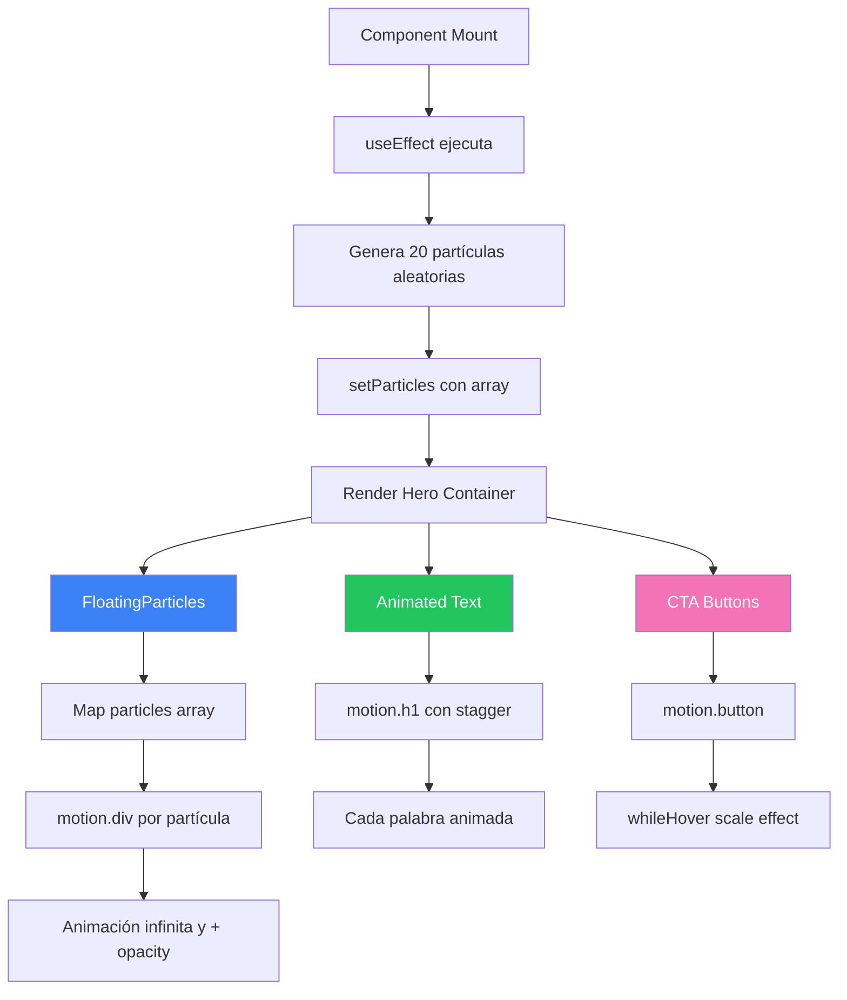

# 🎬 EnhancedHero Component

> Sección hero principal con animaciones de partículas flotantes y efectos Framer Motion.

**Ubicación:** `src/components/sections/EnhancedHero.tsx`  
**Tipo:** 🏝️ React Island  
**Directiva:** `client:load`  
**Bundle:** ~20 KB

---

## 📋 Descripción

`EnhancedHeroSection` es el componente de presentación principal del portafolio. Implementa:

- Texto animado con efectos de aparición escalonada
- Sistema de partículas flotantes con movimiento orgánico
- Gradientes animados de fondo
- CTA buttons con hover effects
- Responsive design para todos los dispositivos

---

## 🔧 API Reference

### JSDoc Principal

```typescript
/**
 * Componente Hero principal con animaciones avanzadas.
 * Implementa partículas flotantes y texto animado.
 * 
 * @component
 * @example
 * ```astro
 * ---
 * import EnhancedHeroSection from '../components/sections/EnhancedHero';
 * ---
 * <EnhancedHeroSection client:load />
 * ```
 * 
 * @returns {JSX.Element} Sección hero con animaciones
 * 
 * @description
 * Características:
 * - Partículas flotantes generadas dinámicamente
 * - Animación de texto con stagger effect
 * - Gradiente de fondo animado
 * - Botones CTA con glow effect
 * - Optimizado para Core Web Vitals
 */
function EnhancedHeroSection(): JSX.Element
```

### Componente FloatingParticles

```typescript
/**
 * Sistema de partículas decorativas flotantes.
 * Genera y anima partículas con movimiento orgánico.
 * 
 * @component
 * @private
 * @returns {JSX.Element} Container con partículas animadas
 * 
 * @example
 * // Uso interno - no exportado
 * <FloatingParticles />
 * 
 * @description
 * - Genera partículas en posiciones aleatorias
 * - Cada partícula tiene delay de animación único
 * - Usa Framer Motion para movimiento suave
 * - No bloquea interactividad (pointer-events: none)
 */
function FloatingParticles(): JSX.Element
```

---

## 🏗️ Estructura Interna

### Interfaces

```typescript
/**
 * Representa una partícula flotante en el sistema.
 * 
 * @interface FloatingParticle
 * @property {number} id - Identificador único de la partícula
 * @property {number} x - Posición X inicial (0-100%)
 * @property {number} y - Posición Y inicial (0-100%)
 * @property {number} delay - Delay de animación en segundos
 */
interface FloatingParticle {
  id: number;
  x: number;
  y: number;
  delay: number;
}
```

### Estado del Componente

```typescript
// Estado para partículas (generadas en mount)
const [particles, setParticles] = useState<FloatingParticle[]>([]);

// Efecto para generar partículas solo en cliente
useEffect(() => {
  const generated = Array.from({ length: 20 }, (_, i) => ({
    id: i,
    x: Math.random() * 100,
    y: Math.random() * 100,
    delay: Math.random() * 5
  }));
  setParticles(generated);
}, []);
```

---

## 📊 Diagrama de Flujo



---

## 🎨 Animaciones

### Configuración de Partículas

```typescript
// Animación base de partículas
const particleAnimation = {
  y: [0, -30, 0],           // Movimiento vertical
  opacity: [0.3, 0.7, 0.3], // Fade in-out
  scale: [1, 1.2, 1],       // Pulso suave
};

const particleTransition = {
  duration: 4,
  repeat: Infinity,
  ease: "easeInOut",
  delay: particle.delay, // Delay único por partícula
};
```

### Animación de Texto (Stagger)

```typescript
const containerVariants = {
  hidden: { opacity: 0 },
  visible: {
    opacity: 1,
    transition: {
      staggerChildren: 0.1,  // 100ms entre cada palabra
      delayChildren: 0.3,    // Delay inicial
    }
  }
};

const wordVariants = {
  hidden: { opacity: 0, y: 20 },
  visible: { 
    opacity: 1, 
    y: 0,
    transition: { duration: 0.5 }
  }
};
```

### Hover Effects en Botones

```typescript
const buttonHover = {
  scale: 1.05,
  boxShadow: "0 0 30px rgba(0, 255, 255, 0.5)",
  transition: { duration: 0.2 }
};
```

---

## ✅ Edge Cases Cubiertos

| Edge Case | Solución | Código |
|-----------|----------|--------|
| **SSR - Math.random()** | Genera partículas en useEffect | `useEffect(() => { /* generate */ }, [])` |
| **Hydration mismatch** | Estado inicial vacío | `useState<FloatingParticle[]>([])` |
| **Performance N partículas** | Limita a 20 partículas | `Array.from({ length: 20 }, ...)` |
| **Partículas sobre contenido** | pointer-events: none | `className="pointer-events-none"` |
| **Mobile performance** | Reduce partículas en mobile | Media query o useMediaQuery |
| **Animación visible en viewport** | viewport prop en motion | `viewport={{ once: true }}` |
| **Reduced motion** | Respeta preferencias | `prefers-reduced-motion` media query |

### Accesibilidad (Reduced Motion)

```typescript
// Detectar preferencia de usuario
const prefersReducedMotion = window.matchMedia(
  '(prefers-reduced-motion: reduce)'
).matches;

// Aplicar animación condicionalmente
<motion.div
  animate={prefersReducedMotion ? {} : particleAnimation}
/>
```

---

## 📦 Dependencias

```json
{
  "react": "^19.1.1",
  "motion": "^12.x"
}
```

---

## 🧪 Testing

### Test Cases Recomendados

```typescript
describe('EnhancedHeroSection', () => {
  it('should render hero text', () => {
    render(<EnhancedHeroSection />);
    expect(screen.getByRole('heading', { level: 1 })).toBeInTheDocument();
  });

  it('should generate particles on mount', async () => {
    render(<EnhancedHeroSection />);
    
    await waitFor(() => {
      const particles = screen.getAllByTestId('floating-particle');
      expect(particles.length).toBe(20);
    });
  });

  it('should render CTA buttons', () => {
    render(<EnhancedHeroSection />);
    expect(screen.getByRole('button', { name: /contact/i })).toBeInTheDocument();
    expect(screen.getByRole('button', { name: /projects/i })).toBeInTheDocument();
  });

  it('should respect reduced motion preference', () => {
    // Mock matchMedia
    window.matchMedia = jest.fn().mockImplementation(query => ({
      matches: query === '(prefers-reduced-motion: reduce)',
    }));
    
    render(<EnhancedHeroSection />);
    // Verify no animations applied
  });
});
```

---

## 📖 Ejemplo de Uso

### En Página Astro

```astro
---
// src/pages/index.astro
import BaseLayout from '../layouts/BaseLayout.astro';
import EnhancedNavigation from '../components/EnhancedNavigation';
import EnhancedHeroSection from '../components/sections/EnhancedHero';
---

<BaseLayout>
  <EnhancedNavigation client:load />
  
  <!-- Hero es above-the-fold, hidrata inmediatamente -->
  <EnhancedHeroSection client:load />
  
  <!-- Resto del contenido -->
</BaseLayout>
```

### Personalización de Contenido

Para modificar el texto del hero, edita las variables internas:

```typescript
const heroTitle = "Dreamcoder08";
const heroSubtitle = "Full Stack Developer";
const heroDescription = "Creando experiencias digitales excepcionales...";
```

---

## 🎯 Performance Tips

1. **Limita partículas**: 20 es el sweet spot para balance visual/performance
2. **Usa will-change**: Solo en elementos que realmente animan
3. **Lazy load imágenes**: Si hay imágenes en hero, usa loading="eager"
4. **Evita layout shifts**: Define tamaños explícitos para CTAs
