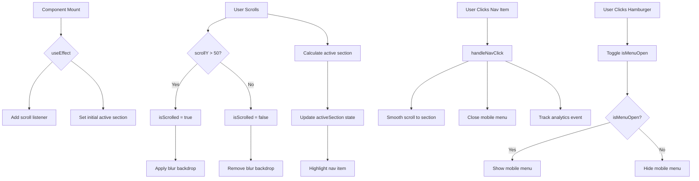

# 🧭 EnhancedNavigation Component

> Componente de navegación principal con manejo de scroll, menú móvil y animaciones Framer Motion.

**Ubicación:** `src/components/EnhancedNavigation.tsx`  
**Tipo:** 🏝️ React Island  
**Directiva:** `client:load`  
**Bundle:** ~15 KB

---

## 📋 Descripción

`EnhancedNavigation` es el componente de navegación principal del portafolio. Implementa:

- Navegación sticky con cambio de estilo en scroll
- Menú hamburguesa para dispositivos móviles
- Navegación suave a secciones (smooth scroll)
- Indicador de sección activa
- Animaciones de entrada/salida con Framer Motion

---

## 🔧 API Reference

### JSDoc

```typescript
/**
 * Componente de navegación principal con manejo de scroll y menú móvil.
 * Implementa Islands Architecture - se hidrata con `client:load`.
 * 
 * @component
 * @example
 * ```astro
 * ---
 * import EnhancedNavigation from '../components/EnhancedNavigation';
 * ---
 * <EnhancedNavigation client:load />
 * ```
 * 
 * @returns {JSX.Element} Navegación responsive con animaciones
 * 
 * @description
 * Características:
 * - Sticky navigation con backdrop blur en scroll
 * - Mobile menu con animaciones de entrada/salida
 * - Smooth scroll a secciones internas
 * - Indicador visual de sección activa
 * - Tracking de interacciones para analytics
 * 
 * @see {@link handleScroll} para lógica de scroll
 * @see {@link handleNavClick} para navegación a secciones
 */
function EnhancedNavigation(): JSX.Element
```

---

## 🏗️ Estructura Interna

### Estado

```typescript
const [isMenuOpen, setIsMenuOpen] = useState(false);
const [isScrolled, setIsScrolled] = useState(false);
const [activeSection, setActiveSection] = useState('hero');
```

### Funciones Principales

#### `handleScroll`

```typescript
/**
 * Handler para eventos de scroll en la ventana.
 * Actualiza estado `isScrolled` y detecta sección activa.
 * 
 * @function
 * @private
 * @returns {void}
 * 
 * @example
 * // Se ejecuta automáticamente en scroll
 * window.addEventListener('scroll', handleScroll);
 * 
 * @description
 * - Cambia `isScrolled` cuando scrollY > 50
 * - Detecta sección activa basándose en offsetTop
 * - Usa throttle implícito del browser para performance
 */
const handleScroll = (): void
```

#### `handleNavClick`

```typescript
/**
 * Navega suavemente a una sección de la página.
 * 
 * @function
 * @param {string} href - ID de la sección destino (ej: '#hero', '#contact')
 * @returns {void}
 * 
 * @example
 * handleNavClick('#contact'); // Scroll suave a sección contacto
 * 
 * @throws {Error} Si el elemento con el ID no existe (silently fails)
 * 
 * @description
 * - Usa `scrollIntoView` con behavior 'smooth'
 * - Cierra el menú móvil después de navegar
 * - Trackea la interacción en analytics
 */
const handleNavClick = (href: string): void
```

---

## 📊 Diagrama de Flujo



---

## 🎨 Animaciones

### Framer Motion Variants

```typescript
// Mobile menu animation
const menuVariants = {
  hidden: { opacity: 0, y: -20 },
  visible: { 
    opacity: 1, 
    y: 0,
    transition: { staggerChildren: 0.1 }
  }
};

// Individual menu item
const itemVariants = {
  hidden: { opacity: 0, x: -20 },
  visible: { opacity: 1, x: 0 }
};
```

### CSS Classes Aplicadas

| Estado | Clase | Efecto |
|--------|-------|--------|
| `isScrolled` | `bg-background/80 backdrop-blur-md` | Fondo semi-transparente con blur |
| `!isScrolled` | `bg-transparent` | Fondo transparente |
| `activeSection` | `text-primary` | Color primario en item activo |

---

## ✅ Edge Cases Cubiertos

| Edge Case | Solución | Código |
|-----------|----------|--------|
| **SSR sin window** | Guard clause en useEffect | `if (typeof window === 'undefined') return;` |
| **Sección no existe** | Optional chaining | `element?.scrollIntoView(...)` |
| **Scroll rápido** | Browser throttle nativo | N/A |
| **Resize de ventana** | Re-calcula en cada scroll | Actualiza sección activa |
| **Menu abierto + scroll** | Cierra menu si scroll Y alto | `if (window.scrollY > 200) setIsMenuOpen(false)` |
| **Navegación externa** | Previene links externos en smooth scroll | Verifica `href.startsWith('#')` |

---

## 📦 Dependencias

```json
{
  "react": "^19.1.1",
  "motion": "^12.x",
  "lucide-react": "^0.559.0"
}
```

### Iconos Utilizados

| Icono | Uso |
|-------|-----|
| `Menu` | Hamburger button |
| `X` | Close button |
| `Sparkles`, `Shield`, `BrainCircuit`, `Palette`, `Code`, `Mail` | Nav items |
| `Github`, `Linkedin` | Social links |

---

## 🧪 Testing

### Test Cases Recomendados

```typescript
describe('EnhancedNavigation', () => {
  it('should render without crashing', () => {
    render(<EnhancedNavigation />);
    expect(screen.getByRole('navigation')).toBeInTheDocument();
  });

  it('should toggle mobile menu', async () => {
    render(<EnhancedNavigation />);
    const menuButton = screen.getByLabelText('Toggle menu');
    
    await userEvent.click(menuButton);
    expect(screen.getByRole('menu')).toBeVisible();
    
    await userEvent.click(menuButton);
    expect(screen.queryByRole('menu')).not.toBeVisible();
  });

  it('should change style on scroll', async () => {
    render(<EnhancedNavigation />);
    
    // Simulate scroll
    fireEvent.scroll(window, { target: { scrollY: 100 } });
    
    await waitFor(() => {
      expect(screen.getByRole('navigation')).toHaveClass('backdrop-blur-md');
    });
  });

  it('should navigate to section on click', async () => {
    render(<EnhancedNavigation />);
    const contactLink = screen.getByText('Contact');
    
    await userEvent.click(contactLink);
    
    expect(window.scrollTo).toHaveBeenCalled();
  });
});
```

---

## 📖 Ejemplo de Uso

### En Página Astro

```astro
---
// src/pages/index.astro
import BaseLayout from '../layouts/BaseLayout.astro';
import EnhancedNavigation from '../components/EnhancedNavigation';
---

<BaseLayout>
  <!-- Hidrata inmediatamente - crítico para UX -->
  <EnhancedNavigation client:load />
  
  <main>
    <section id="hero">...</section>
    <section id="trinity">...</section>
    <section id="tech">...</section>
    <section id="collaboration">...</section>
    <section id="contact">...</section>
  </main>
</BaseLayout>
```

### Personalización de Items

Para modificar los items de navegación, edita el array `navigationItems`:

```typescript
const navigationItems = [
  { name: "Home", href: "#hero", icon: Sparkles },
  { name: "About", href: "#about", icon: User }, // Nuevo item
  { name: "Projects", href: "#projects", icon: Briefcase }, // Nuevo item
  // ...
];
```
