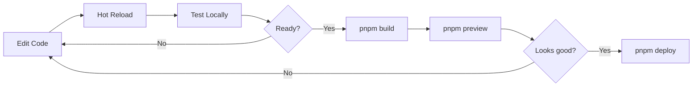

# 🚀 Guía de Inicio Rápido

> Configuración inicial del proyecto Dreamfolio Astro en tu entorno local.

---

## 📋 Prerrequisitos

| Herramienta | Versión Mínima | Verificar |
|-------------|----------------|-----------|
| **Node.js** | 18.x | `node --version` |
| **pnpm** | 8.x | `pnpm --version` |
| **Git** | 2.x | `git --version` |

---

## 🔧 Instalación

### 1. Clonar el Repositorio

```bash
git clone https://github.com/dreamcoder08/dreamfolio-astro.git
cd dreamfolio-astro
```

### 2. Instalar Dependencias

```bash
pnpm install
```

### 3. Configurar Variables de Entorno

```bash
# Copiar template
cp .env.example .env

# Editar con tus credenciales
nano .env
```

**Variables requeridas:**

```bash
# Supabase (opcional para desarrollo)
PUBLIC_SUPABASE_URL=https://your-project.supabase.co
PUBLIC_SUPABASE_ANON_KEY=eyJhbGciOiJIUzI1NiIsInR5cCI6IkpXVCJ9...
```

> 💡 **Nota:** El proyecto funciona sin Supabase configurado (usa mock client).

### 4. Iniciar Servidor de Desarrollo

```bash
pnpm dev
```

Abre [http://localhost:4321](http://localhost:4321) en tu navegador.

---

## 📂 Estructura del Proyecto

```text
dreamfolio-astro/
├── docs/                 # 📚 Documentación (estás aquí)
├── public/               # 📁 Assets estáticos
├── src/
│   ├── components/       # 🧩 Componentes UI
│   │   ├── sections/     # Secciones de página
│   │   └── ui/           # Componentes base
│   ├── layouts/          # 📐 Layouts Astro
│   ├── lib/              # 📦 Utilidades
│   ├── pages/            # 📄 Páginas/Rutas
│   └── styles/           # 🎨 Estilos globales
├── astro.config.mjs      # ⚙️ Configuración Astro
├── tailwind.config.mjs   # 🎨 Configuración Tailwind
└── package.json          # 📦 Dependencias
```

---

## 🛠️ Scripts Disponibles

| Comando | Descripción |
|---------|-------------|
| `pnpm dev` | Servidor de desarrollo en puerto 4321 |
| `pnpm build` | Build de producción a `dist/` |
| `pnpm preview` | Preview del build de producción |
| `pnpm deploy` | Deploy a Vercel (producción) |
| `pnpm deploy:staging` | Deploy a Vercel (staging) |
| `pnpm lighthouse` | Análisis Lighthouse local |
| `pnpm clean` | Limpia `dist/` y cache |

---

## 🔄 Flujo de Desarrollo



---

## 🎨 Añadir Nuevos Componentes

### Nuevo Componente Astro (Estático)

```astro
---
// src/components/sections/NewSection.astro
interface Props {
  title: string;
}

const { title } = Astro.props;
---

<section class="py-20">
  <h2 class="text-3xl font-bold">{title}</h2>
  <slot />
</section>
```

### Nuevo Componente React (Island)

```tsx
// src/components/sections/InteractiveSection.tsx
import React, { useState } from 'react';
import { motion } from 'motion/react';

export default function InteractiveSection() {
  const [count, setCount] = useState(0);
  
  return (
    <motion.section
      initial={{ opacity: 0 }}
      animate={{ opacity: 1 }}
    >
      <button onClick={() => setCount(c => c + 1)}>
        Clicked: {count}
      </button>
    </motion.section>
  );
}
```

**Usar en página:**

```astro
---
import InteractiveSection from '../components/sections/InteractiveSection';
---

<!-- Solo carga JS cuando es visible -->
<InteractiveSection client:visible />
```

---

## 📊 Verificar Performance

### Lighthouse Local

```bash
# Build y preview
pnpm build && pnpm preview

# En otra terminal, correr Lighthouse
pnpm lighthouse
```

### Web Vitals en Consola

Abre DevTools (F12) y observa los logs de performance en la consola durante desarrollo.

---

## ❓ Solución de Problemas

### Error: Cannot find module

```bash
# Limpiar y reinstalar
pnpm clean
rm -rf node_modules
pnpm install
```

### Error: Supabase not configured

El proyecto usa un mock client automáticamente. Para funcionalidad completa:

1. Crea proyecto en [supabase.com](https://supabase.com)
2. Copia URL y anon key al `.env`
3. Reinicia el servidor de desarrollo

### Build falla en Vercel

Verifica que las variables de entorno estén configuradas en el dashboard de Vercel.

---

## 📚 Próximos Pasos

- [Mejores Prácticas 2025](./best-practices.md) - Stack recomendado
- [Arquitectura](../architecture/README.md) - Decisiones técnicas
- [Componentes](../components/README.md) - Documentación de UI
