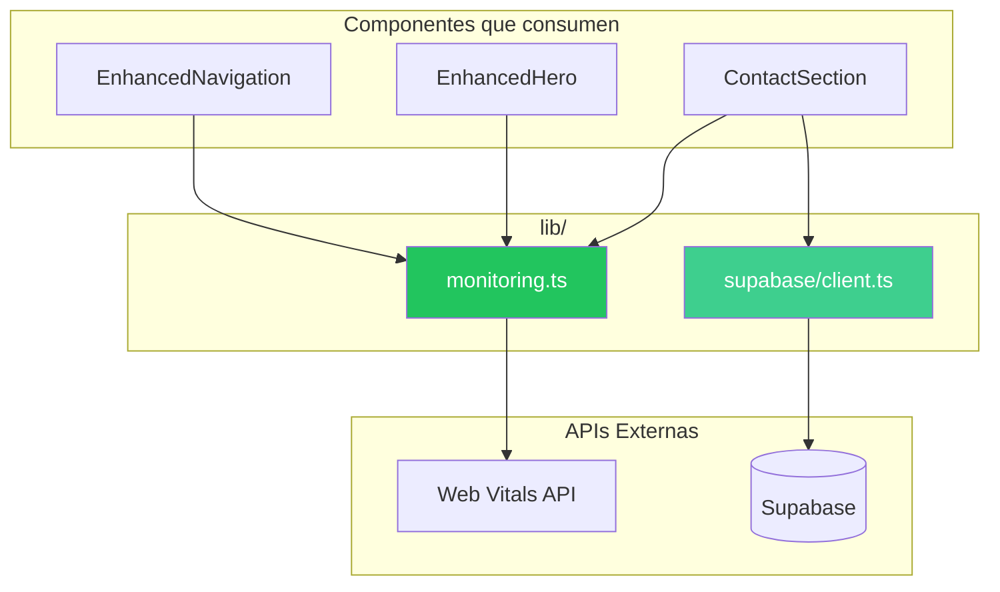

# 📦 Índice de Utilidades

> Documentación de servicios, helpers y utilidades compartidas del proyecto.

---

## 📋 Resumen

| Utilidad | Archivo | Propósito |
|----------|---------|-----------|
| **MonitoringService** | `lib/monitoring.ts` | Core Web Vitals + Analytics |
| **Supabase Client** | `lib/supabase/client.ts` | Cliente de base de datos |

---

## 🏗️ Arquitectura de Utilidades



---

## 📖 Documentación Detallada

| Utilidad | Descripción | Documentación |
|----------|-------------|---------------|
| **MonitoringService** | Servicio singleton para tracking de Core Web Vitals (FCP, LCP, CLS, FID, TTFB), eventos de usuario y errores | [📖 monitoring.md](./monitoring.md) |
| **Supabase Client** | Cliente Supabase con mock para build time y configuración de auth | [📖 supabase.md](./supabase.md) |

---

## 🔧 Patrones Utilizados

### Singleton Pattern (MonitoringService)

```typescript
// Instancia única exportada
export const monitoring = new MonitoringService();

// Uso en componentes
import { monitoring, trackButtonClick } from '../lib/monitoring';

trackButtonClick('cta-contact');
```

### Factory Pattern (Supabase Client)

```typescript
// Factory que decide si crear cliente real o mock
const createSupabaseClient = () => {
  if (!supabaseUrl || !supabaseAnonKey) {
    return mockClient;
  }
  return createClient(supabaseUrl, supabaseAnonKey, options);
};

export const supabase = createSupabaseClient();
```

---

## ✅ Edge Cases Globales

| Edge Case | Utilidad | Solución |
|-----------|----------|----------|
| **SSR sin window** | MonitoringService | Guard `typeof window !== 'undefined'` |
| **Build sin env vars** | Supabase Client | Mock client que retorna promesas vacías |
| **PerformanceObserver no soportado** | MonitoringService | Try-catch con fallback graceful |
| **Supabase RLS** | Supabase Client | Políticas configuradas en Supabase dashboard |

---

## 📚 Guías Relacionadas

- [Mejores Prácticas 2025](../guides/best-practices.md)
- [Inicio Rápido](../guides/getting-started.md)
