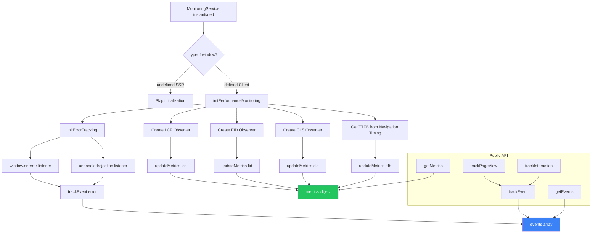

# 📊 MonitoringService

> Servicio de monitoreo para Core Web Vitals, eventos de usuario y tracking de errores.

**Ubicación:** `src/lib/monitoring.ts`  
**Patrón:** Singleton  
**Bundle Impact:** ~3 KB (tree-shaken)

---

## 📋 Descripción

`MonitoringService` es un servicio singleton que implementa:

- **Core Web Vitals Tracking**: FCP, LCP, CLS, FID, TTFB
- **Event Tracking**: Page views, interacciones, errores
- **Error Boundary**: Captura errores globales y promesas rechazadas
- **Analytics Integration**: Preparado para enviar a servicios externos

---

## 🔧 API Reference

### Interfaces

```typescript
/**
 * Métricas de rendimiento Core Web Vitals.
 * Estándar de Google para medir la experiencia de usuario.
 * 
 * @interface PerformanceMetrics
 * @property {number} fcp - First Contentful Paint (ms)
 *   - Tiempo hasta que se pinta el primer contenido
 *   - Objetivo: < 1.8s (bueno), < 3s (necesita mejora)
 * 
 * @property {number} lcp - Largest Contentful Paint (ms)
 *   - Tiempo hasta que el elemento más grande es visible
 *   - Objetivo: < 2.5s (bueno), < 4s (necesita mejora)
 * 
 * @property {number} cls - Cumulative Layout Shift
 *   - Suma de todos los layout shifts inesperados
 *   - Objetivo: < 0.1 (bueno), < 0.25 (necesita mejora)
 * 
 * @property {number} fid - First Input Delay (ms)
 *   - Tiempo desde primera interacción hasta respuesta
 *   - Objetivo: < 100ms (bueno), < 300ms (necesita mejora)
 * 
 * @property {number} ttfb - Time to First Byte (ms)
 *   - Tiempo hasta recibir primer byte del servidor
 *   - Objetivo: < 600ms (bueno)
 * 
 * @see https://web.dev/vitals/
 */
interface PerformanceMetrics {
  fcp: number;
  lcp: number;
  cls: number;
  fid: number;
  ttfb: number;
}
```

```typescript
/**
 * Evento de usuario para tracking.
 * 
 * @interface UserEvent
 * @property {'page_view' | 'interaction' | 'error' | 'performance'} type
 * @property {Record<string, any>} data - Datos específicos del evento
 * @property {number} timestamp - Unix timestamp en ms
 * @property {string} url - URL donde ocurrió el evento
 * @property {string} userAgent - User agent del navegador
 */
interface UserEvent {
  type: 'page_view' | 'interaction' | 'error' | 'performance';
  data: Record<string, any>;
  timestamp: number;
  url: string;
  userAgent: string;
}
```

### Clase MonitoringService

```typescript
/**
 * Servicio de monitoreo de rendimiento y eventos.
 * Implementa patrón Singleton - usar instancia exportada `monitoring`.
 * 
 * @class MonitoringService
 * 
 * @example
 * import { monitoring } from '../lib/monitoring';
 * 
 * // Track page view
 * monitoring.trackPageView('/about');
 * 
 * // Track interaction
 * monitoring.trackInteraction('button', 'click', { id: 'cta-hero' });
 * 
 * // Get collected metrics
 * const metrics = monitoring.getMetrics();
 * console.log(`LCP: ${metrics?.lcp}ms`);
 */
class MonitoringService {
  private metrics: PerformanceMetrics | null = null;
  private events: UserEvent[] = [];

  constructor();
  
  // Métodos públicos
  trackEvent(type: UserEvent['type'], data: Record<string, any>): void;
  trackPageView(page: string): void;
  trackInteraction(element: string, action: string, data?: Record<string, any>): void;
  getMetrics(): PerformanceMetrics | null;
  getEvents(): UserEvent[];
  clearEvents(): void;
}
```

---

## 🏗️ Métodos Detallados

### `constructor()`

```typescript
/**
 * Inicializa el servicio de monitoreo.
 * Solo ejecuta en cliente (guarda contra SSR).
 * 
 * @constructor
 * 
 * @description
 * Acciones en inicialización:
 * 1. Verifica que `window` existe (SSR guard)
 * 2. Inicializa Performance Observers para Web Vitals
 * 3. Configura error tracking global
 * 
 * @example
 * // No llamar directamente - usar singleton
 * import { monitoring } from '../lib/monitoring';
 */
constructor() {
  if (typeof window !== 'undefined') {
    this.initPerformanceMonitoring();
    this.initErrorTracking();
  }
}
```

### `initPerformanceMonitoring()`

```typescript
/**
 * Inicializa observers para Core Web Vitals.
 * 
 * @private
 * @method initPerformanceMonitoring
 * @returns {void}
 * 
 * @description
 * Configura PerformanceObserver para:
 * - `largest-contentful-paint` (LCP)
 * - `first-input` (FID)
 * - `layout-shift` (CLS)
 * 
 * También usa Navigation Timing API para TTFB.
 * 
 * @throws {Error} Capturado silenciosamente si PerformanceObserver no es soportado
 */
```

### `initErrorTracking()`

```typescript
/**
 * Configura listeners globales para errores.
 * 
 * @private
 * @method initErrorTracking
 * @returns {void}
 * 
 * @description
 * Captura:
 * - `window.onerror` - Errores de runtime
 * - `unhandledrejection` - Promesas rechazadas no manejadas
 * 
 * Datos capturados:
 * - message, filename, lineno, colno, stack trace
 * 
 * @example
 * // Estos errores se capturan automáticamente:
 * throw new Error('Test error');
 * Promise.reject('Unhandled rejection');
 */
```

### `trackEvent()`

```typescript
/**
 * Trackea un evento personalizado.
 * 
 * @public
 * @method trackEvent
 * @param {UserEvent['type']} type - Tipo de evento
 * @param {Record<string, any>} data - Datos del evento
 * @returns {void}
 * 
 * @example
 * monitoring.trackEvent('interaction', {
 *   element: 'form',
 *   action: 'submit',
 *   formName: 'contact',
 *   success: true
 * });
 * 
 * @description
 * - Añade timestamp, URL y userAgent automáticamente
 * - En producción, envía a servidor de analytics
 * - En desarrollo, loguea a consola
 */
trackEvent(type: UserEvent['type'], data: Record<string, any>): void
```

### `trackPageView()`

```typescript
/**
 * Trackea una vista de página.
 * 
 * @public
 * @method trackPageView
 * @param {string} page - Identificador de la página (ej: '/about', 'home')
 * @returns {void}
 * 
 * @example
 * // En un componente de navegación
 * useEffect(() => {
 *   monitoring.trackPageView(window.location.pathname);
 * }, []);
 * 
 * // Al cambiar de ruta (SPA navigation)
 * router.events.on('routeChangeComplete', (url) => {
 *   monitoring.trackPageView(url);
 * });
 */
trackPageView(page: string): void
```

### `trackInteraction()`

```typescript
/**
 * Trackea una interacción de usuario.
 * 
 * @public
 * @method trackInteraction
 * @param {string} element - Tipo de elemento (button, form, link, etc.)
 * @param {string} action - Acción realizada (click, submit, hover, etc.)
 * @param {Record<string, any>} [data] - Datos adicionales opcionales
 * @returns {void}
 * 
 * @example
 * // Click en botón
 * monitoring.trackInteraction('button', 'click', { 
 *   buttonName: 'cta-hero',
 *   position: 'above-fold'
 * });
 * 
 * // Submit de formulario
 * monitoring.trackInteraction('form', 'submit', {
 *   formName: 'contact',
 *   success: true
 * });
 */
trackInteraction(element: string, action: string, data?: Record<string, any>): void
```

---

## 📊 Diagrama de Flujo



---

## 📦 Funciones Helper Exportadas

```typescript
/**
 * Trackea click en botón.
 * Wrapper conveniente para trackInteraction.
 * 
 * @function trackButtonClick
 * @param {string} buttonName - Nombre identificador del botón
 * @param {Record<string, any>} [additionalData] - Datos extra
 * @returns {void}
 * 
 * @example
 * import { trackButtonClick } from '../lib/monitoring';
 * 
 * <button onClick={() => trackButtonClick('cta-hero')}>
 *   Contact Me
 * </button>
 */
export const trackButtonClick = (
  buttonName: string, 
  additionalData?: Record<string, any>
): void => {
  monitoring.trackInteraction('button', 'click', { 
    buttonName, 
    ...additionalData 
  });
};
```

```typescript
/**
 * Trackea submit de formulario.
 * 
 * @function trackFormSubmit
 * @param {string} formName - Nombre del formulario
 * @param {boolean} success - Si el submit fue exitoso
 * @returns {void}
 * 
 * @example
 * import { trackFormSubmit } from '../lib/monitoring';
 * 
 * const onSubmit = async (data) => {
 *   try {
 *     await submitForm(data);
 *     trackFormSubmit('contact', true);
 *   } catch {
 *     trackFormSubmit('contact', false);
 *   }
 * };
 */
export const trackFormSubmit = (
  formName: string, 
  success: boolean
): void => {
  monitoring.trackInteraction('form', 'submit', { formName, success });
};
```

```typescript
/**
 * Trackea vista de página.
 * Wrapper para uso directo.
 * 
 * @function trackPageView
 * @param {string} page - Identificador de página
 * @returns {void}
 * 
 * @example
 * import { trackPageView } from '../lib/monitoring';
 * 
 * trackPageView('/projects');
 */
export const trackPageView = (page: string): void => {
  monitoring.trackPageView(page);
};
```

---

## ✅ Edge Cases Cubiertos

| Edge Case | Solución | Código |
|-----------|----------|--------|
| **SSR sin window** | Guard en constructor | `if (typeof window !== 'undefined')` |
| **PerformanceObserver no soportado** | Try-catch silencioso | `try { ... } catch { console.log('not supported') }` |
| **Múltiples instancias** | Singleton export | `export const monitoring = new MonitoringService()` |
| **Eventos sin limpiar** | Método clearEvents | `monitoring.clearEvents()` |
| **Producción vs Dev** | Condicional en sendToAnalytics | `if (import.meta.env.PROD)` |
| **Error tracking loop** | No trackear errores de tracking | Condicional en handler |

---

## 🧪 Testing

```typescript
describe('MonitoringService', () => {
  let monitoring: MonitoringService;
  
  beforeEach(() => {
    monitoring = new MonitoringService();
  });
  
  afterEach(() => {
    monitoring.clearEvents();
  });

  it('should track page view', () => {
    monitoring.trackPageView('/test');
    
    const events = monitoring.getEvents();
    expect(events).toHaveLength(1);
    expect(events[0].type).toBe('page_view');
    expect(events[0].data.page).toBe('/test');
  });

  it('should track interaction', () => {
    monitoring.trackInteraction('button', 'click', { id: 'test' });
    
    const events = monitoring.getEvents();
    expect(events[0].type).toBe('interaction');
    expect(events[0].data.element).toBe('button');
  });

  it('should clear events', () => {
    monitoring.trackPageView('/test');
    monitoring.clearEvents();
    
    expect(monitoring.getEvents()).toHaveLength(0);
  });

  it('should not crash in SSR', () => {
    // Mock window as undefined
    const originalWindow = global.window;
    delete (global as any).window;
    
    expect(() => new MonitoringService()).not.toThrow();
    
    (global as any).window = originalWindow;
  });
});
```

---

## 📖 Ejemplo de Uso Completo

```typescript
// src/components/MyComponent.tsx
import React from 'react';
import { 
  monitoring, 
  trackButtonClick, 
  trackFormSubmit 
} from '../lib/monitoring';

export function MyComponent() {
  // Track page view on mount
  useEffect(() => {
    monitoring.trackPageView('my-component');
    
    // Log current metrics after load
    setTimeout(() => {
      const metrics = monitoring.getMetrics();
      if (metrics) {
        console.log('Core Web Vitals:', {
          LCP: `${metrics.lcp}ms`,
          FID: `${metrics.fid}ms`,
          CLS: metrics.cls,
          TTFB: `${metrics.ttfb}ms`
        });
      }
    }, 3000);
  }, []);

  const handleClick = () => {
    trackButtonClick('my-button', { section: 'hero' });
    // ... rest of handler
  };

  const handleSubmit = async (data: FormData) => {
    try {
      await submitData(data);
      trackFormSubmit('my-form', true);
    } catch (error) {
      trackFormSubmit('my-form', false);
    }
  };

  return (
    <div>
      <button onClick={handleClick}>Click me</button>
      <form onSubmit={handleSubmit}>...</form>
    </div>
  );
}
```
