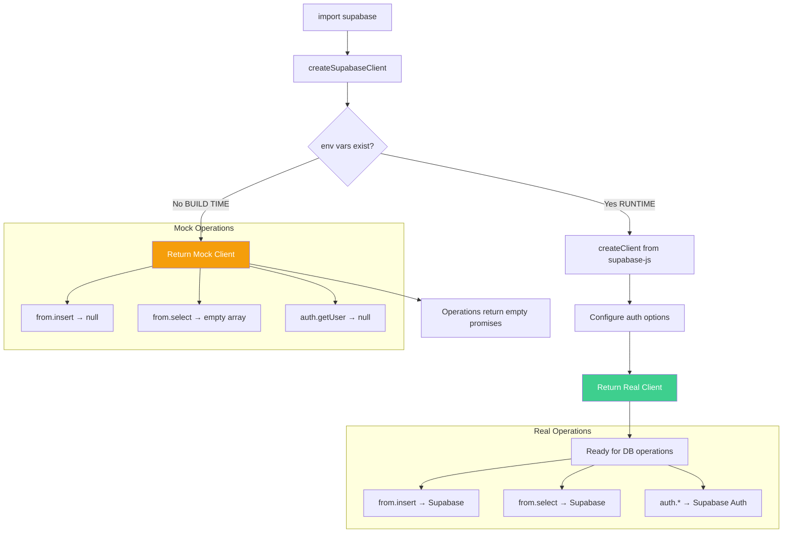

# 💾 Supabase Client

> Cliente de Supabase con soporte para build-time y runtime.

**Ubicación:** `src/lib/supabase/client.ts`  
**Patrón:** Factory Pattern  
**Bundle Impact:** ~2 KB (tree-shaken)

---

## 📋 Descripción

El cliente Supabase está diseñado para:

- Funcionar en entorno de build (sin variables de entorno)
- Proporcionar cliente real en runtime
- Configurar autenticación automática
- Ser type-safe con TypeScript

---

## 🔧 API Reference

### createSupabaseClient()

```typescript
/**
 * Factory function que crea el cliente Supabase apropiado.
 * Retorna mock client si las variables de entorno no están disponibles.
 * 
 * @function createSupabaseClient
 * @returns {SupabaseClient | MockClient} Cliente Supabase o mock
 * 
 * @example
 * // Uso interno - no llamar directamente
 * const client = createSupabaseClient();
 * 
 * // Usar el export singleton
 * import { supabase } from '../lib/supabase/client';
 * 
 * @description
 * Comportamiento:
 * - Build time (sin env vars): Retorna mock client
 * - Runtime (con env vars): Retorna cliente Supabase real
 * 
 * Configuración del cliente real:
 * - autoRefreshToken: true (refresca tokens automáticamente)
 * - persistSession: true (persiste sesión en localStorage)
 * - detectSessionInUrl: true (detecta OAuth redirects)
 * 
 * @throws {Error} No lanza - siempre retorna un cliente válido
 */
const createSupabaseClient = (): SupabaseClient | MockClient
```

### Mock Client

```typescript
/**
 * Cliente mock para build time.
 * Todas las operaciones retornan promesas vacías exitosas.
 * 
 * @description
 * Métodos mock disponibles:
 * - from(table).insert() → { error: null }
 * - from(table).select() → { data: [], error: null }
 * - from(table).update() → { error: null }
 * - from(table).delete() → { error: null }
 * - auth.signInWithPassword() → { data: null, error: null }
 * - auth.signUp() → { data: null, error: null }
 * - auth.signOut() → { error: null }
 * - auth.getUser() → { data: { user: null }, error: null }
 */
const mockClient = {
  from: () => ({
    insert: () => Promise.resolve({ error: null }),
    select: () => Promise.resolve({ data: [], error: null }),
    update: () => Promise.resolve({ error: null }),
    delete: () => Promise.resolve({ error: null }),
  }),
  auth: {
    signInWithPassword: () => Promise.resolve({ data: null, error: null }),
    signUp: () => Promise.resolve({ data: null, error: null }),
    signOut: () => Promise.resolve({ error: null }),
    getUser: () => Promise.resolve({ data: { user: null }, error: null }),
  },
};
```

---

## 📊 Diagrama de Flujo



---

## ⚙️ Configuración

### Variables de Entorno Requeridas

```bash
# .env
PUBLIC_SUPABASE_URL=https://your-project.supabase.co
PUBLIC_SUPABASE_ANON_KEY=eyJhbGciOiJIUzI1NiIsInR5cCI6IkpXVCJ9...
```

### Configuración del Cliente

```typescript
const clientOptions = {
  auth: {
    // Refresca tokens antes de expirar
    autoRefreshToken: true,
    
    // Guarda sesión en localStorage
    persistSession: true,
    
    // Detecta tokens en URL (OAuth callback)
    detectSessionInUrl: true
  }
};
```

---

## ✅ Edge Cases Cubiertos

| Edge Case | Solución | Código |
|-----------|----------|--------|
| **Build sin env vars** | Mock client | `if (!supabaseUrl) return mockClient` |
| **SSR hydration** | Same interface mock/real | Ambos implementan misma API |
| **Auth callback URL** | detectSessionInUrl | `detectSessionInUrl: true` |
| **Token expirado** | Auto refresh | `autoRefreshToken: true` |
| **Sesión perdida** | Persist en localStorage | `persistSession: true` |
| **Type safety** | Cast to any para mock | `} as any` |

---

## 📦 Uso con TypeScript

### Tipos de Supabase

```typescript
// Generar tipos desde Supabase CLI
// npx supabase gen types typescript --project-id YOUR_PROJECT > src/types/supabase.ts

import { Database } from '../types/supabase';
import { createClient } from '@supabase/supabase-js';

// Cliente tipado
const supabase = createClient<Database>(url, key);

// Operaciones tipadas
const { data, error } = await supabase
  .from('contacts')  // Autocompletado de tablas
  .select('*');      // data tiene tipo inferido
```

---

## 📖 Ejemplos de Uso

### Insertar Datos

```typescript
import { supabase } from '../lib/supabase/client';

/**
 * Inserta un nuevo contacto en la base de datos.
 * 
 * @param contact - Datos del contacto
 * @throws {Error} Si falla la inserción
 */
async function insertContact(contact: {
  name: string;
  email: string;
  message: string;
}) {
  const { error } = await supabase
    .from('contacts')
    .insert([contact]);
  
  if (error) {
    throw new Error(`Failed to insert contact: ${error.message}`);
  }
}
```

### Leer Datos

```typescript
/**
 * Obtiene todos los proyectos destacados.
 * 
 * @returns Lista de proyectos
 */
async function getFeaturedProjects() {
  const { data, error } = await supabase
    .from('projects')
    .select('*')
    .eq('featured', true)
    .order('created_at', { ascending: false });
  
  if (error) {
    console.error('Failed to fetch projects:', error);
    return [];
  }
  
  return data;
}
```

### Autenticación

```typescript
/**
 * Inicia sesión con email y password.
 * No usado en el portafolio actual (público).
 */
async function signIn(email: string, password: string) {
  const { data, error } = await supabase.auth.signInWithPassword({
    email,
    password
  });
  
  if (error) {
    throw error;
  }
  
  return data.user;
}
```

---

## 🧪 Testing

```typescript
import { supabase } from '../lib/supabase/client';

describe('Supabase Client', () => {
  it('should export a client', () => {
    expect(supabase).toBeDefined();
    expect(supabase.from).toBeInstanceOf(Function);
  });

  it('should have auth methods', () => {
    expect(supabase.auth.signInWithPassword).toBeInstanceOf(Function);
    expect(supabase.auth.signUp).toBeInstanceOf(Function);
    expect(supabase.auth.signOut).toBeInstanceOf(Function);
  });

  describe('Mock client (build time)', () => {
    it('should return empty data for select', async () => {
      // Simular build time - env vars no disponibles
      jest.resetModules();
      jest.mock('import.meta.env', () => ({}));
      
      const { supabase: mockSupabase } = require('../lib/supabase/client');
      
      const { data, error } = await mockSupabase
        .from('any_table')
        .select();
      
      expect(data).toEqual([]);
      expect(error).toBeNull();
    });
  });
});
```

---

## 🔐 Seguridad

### Row Level Security (RLS)

Configura RLS en Supabase dashboard:

```sql
-- Tabla contacts: Solo insertar públicamente
ALTER TABLE contacts ENABLE ROW LEVEL SECURITY;

CREATE POLICY "Public can insert contacts" ON contacts
  FOR INSERT WITH CHECK (true);

CREATE POLICY "Only auth users can read" ON contacts
  FOR SELECT USING (auth.role() = 'authenticated');
```

### Nunca exponer service_role key

```bash
# ❌ NUNCA en frontend
SUPABASE_SERVICE_ROLE_KEY=... 

# ✅ Solo usar anon key en público
PUBLIC_SUPABASE_ANON_KEY=...
```
