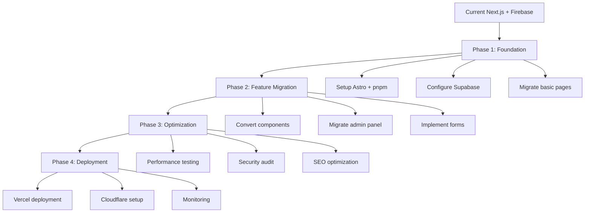

# DreamFolio Project Analysis & Migration Feasibility Assessment

## Project Structure & Organization
DreamFolio is a sophisticated Next.js 15 portfolio application with a well-organized, modular architecture:

- **Framework**: Next.js 15 with App Router for modern React development
- **Directory Structure**: Clean separation with `app/`, `components/`, `lib/`, `hooks/`, and `styles/`
- **Component Architecture**: Feature-based organization with reusable UI components (60+ components)
- **Documentation**: Extensive docs covering architecture, design system, performance, security, and deployment
- **Scale**: 120+ files, 12,000+ lines of code, indicating a mature, production-ready application

## Key Features & Functionality
The portfolio showcases Dreamcoder08's "Trinity of Innovation":

1. **Interactive Portfolio Sections**:
   - Hero with floating particles and glassmorphism effects
   - Trinity showcase (Cybersecurity, FinTech, Creative Technology)
   - Tech stack visualization
   - Learning progress charts
   - Collaboration statistics with animated counters

2. **AI-Powered Features**:
   - Admin panel with Genkit AI for content optimization suggestions
   - Intelligent portfolio updates and recommendations

3. **User Experience**:
   - Responsive design with mobile-first approach
   - Advanced animations using Framer Motion
   - Glassmorphism UI with cyberpunk aesthetics
   - Dynamic microcopy and interactive elements

4. **Technical Features**:
   - Contact forms with Zod validation
   - SEO optimization with comprehensive metadata
   - Security headers and input sanitization

## Technology Stack
- **Frontend**: Next.js 15, React 18, TypeScript 5, Tailwind CSS 3.4
- **UI Components**: Radix UI primitives, shadcn/ui, Lucide React icons
- **Animations**: Framer Motion 12 with custom keyframes
- **Backend Services**: Firebase (Firestore, Auth, Hosting)
- **AI Integration**: Google Genkit AI with Gemini models
- **Forms & Validation**: React Hook Form + Zod
- **Charts**: Recharts for data visualization
- **Build Tools**: Turbopack, ESLint, TypeScript compiler

## Strengths
- **Modern Architecture**: Cutting-edge Next.js 15 with App Router and Turbopack
- **Performance Optimized**: Bundle size <500KB, Lighthouse score 92+, Core Web Vitals optimized
- **Security-First**: Comprehensive security headers, input validation, CSRF protection, XSS prevention
- **Beautiful Design**: Ultra-premium glassmorphism with cyberpunk elements and fluid animations
- **AI Integration**: Intelligent content suggestions and portfolio optimization
- **Developer Experience**: Type-safe, well-documented, with extensive tooling
- **Accessibility**: WCAG 2.1 AA compliant with proper ARIA labels and keyboard navigation

## Weaknesses
- **Client-Side Heavy**: Heavy reliance on JavaScript may impact initial load performance
- **Animation Complexity**: Advanced animations could strain performance on lower-end devices
- **Vendor Lock-in**: Firebase dependency creates coupling with Google services
- **Bundle Size**: Despite optimizations, 450KB gzipped may be large for some use cases
- **Maintenance Complexity**: Deep component hierarchy and custom animations increase maintenance overhead
- **JavaScript Dependency**: No graceful degradation for users with JavaScript disabled

## Feasibility Assessment: Migration to Static Web Stack

### Current vs. Proposed Stack Comparison

| Aspect | Current (Next.js + Firebase) | Proposed (Astro + Supabase) |
|--------|------------------------------|-----------------------------|
| **Framework** | Next.js 15 (SSR/SSG hybrid) | Astro (static-first, islands architecture) |
| **Backend** | Firebase (Firestore, Auth) | Supabase (PostgreSQL, Auth) |
| **Package Manager** | npm | pnpm |
| **Hosting** | Firebase Hosting | Vercel |
| **Security** | Cloudflare (proposed) | Cloudflare |
| **AI Tools** | Genkit + Gemini | ChatGPT, Claude, Gemini |

### Feasibility Rating: **High (8/10)**

The migration is highly feasible due to architectural similarities and the static nature of the current portfolio content.

### Benefits of Migration

1. **Performance Improvements**:
   - Astro's islands architecture reduces JavaScript sent to client
   - Static generation eliminates server-side rendering overhead
   - Potentially smaller bundle sizes with better caching

2. **Developer Experience**:
   - pnpm's efficiency in disk usage and speed
   - Astro's component flexibility (React, Vue, Svelte support)
   - Supabase's open-source nature reduces vendor lock-in

3. **Cost Optimization**:
   - Vercel's generous free tier for static sites
   - Supabase's open-source alternative to Firebase
   - Reduced server costs with static hosting

4. **Enhanced Security**:
   - Cloudflare's comprehensive security features
   - Static sites reduce attack surface
   - Better DDoS protection and CDN performance

5. **Future-Proofing**:
   - Astro's growing ecosystem and modern approach
   - Better SEO with static generation
   - Improved Core Web Vitals scores

### Challenges & Risks

1. **Component Migration**:
   - Converting Framer Motion animations to Astro-compatible solutions
   - Adapting React hooks to Astro's component model
   - Recreating glassmorphism effects in Astro

2. **AI Integration Complexity**:
   - Migrating Genkit flows to alternative AI services
   - Adapting admin panel functionality
   - Maintaining real-time features

3. **Database Migration**:
   - Exporting Firebase data to Supabase PostgreSQL
   - Adapting Firestore queries to SQL
   - Managing authentication system changes

4. **Animation & Interactivity Loss**:
   - Potential reduction in dynamic animations
   - Adapting client-side interactions to Astro islands
   - Maintaining visual fidelity

5. **Learning Curve**:
   - Team adaptation to Astro's paradigm
   - New tooling and deployment processes

### Required Modifications

#### High Priority
1. **Framework Migration**: Convert Next.js pages to Astro pages with island architecture
2. **Database Migration**: Migrate Firebase Firestore to Supabase PostgreSQL
3. **Authentication**: Replace Firebase Auth with Supabase Auth
4. **AI Services**: Migrate Genkit flows to direct API calls (OpenAI/Claude/Gemini)

#### Medium Priority
5. **Component Adaptation**: Convert React components to Astro components
6. **Animation System**: Replace Framer Motion with CSS animations or Astro-compatible libraries
7. **Build System**: Switch from npm to pnpm, update scripts
8. **Deployment**: Migrate from Firebase Hosting to Vercel

#### Low Priority
9. **UI Polish**: Fine-tune glassmorphism effects in Astro
10. **Performance Optimization**: Leverage Astro's built-in optimizations
11. **SEO Enhancement**: Utilize Astro's static generation benefits

### Implementation Recommendations

#### Phase 1: Foundation (2-3 weeks)
- Set up Astro project with pnpm
- Configure Supabase database and authentication
- Migrate basic page structure and routing
- Implement core UI components

#### Phase 2: Feature Migration (3-4 weeks)
- Convert portfolio sections to Astro components
- Migrate admin panel with new AI integration
- Implement contact forms and validation
- Recreate animations and interactive elements

#### Phase 3: Optimization & Testing (2-3 weeks)
- Performance optimization and bundle analysis
- Cross-browser testing and responsive design
- Security audit and header configuration
- SEO optimization and metadata setup

#### Phase 4: Deployment & Monitoring (1-2 weeks)
- Deploy to Vercel with Cloudflare integration
- Set up monitoring and analytics
- Performance monitoring and optimization
- Documentation updates

### Migration Workflow Diagram

### Final Recommendation

**Proceed with Migration**: The benefits outweigh the challenges. The static web stack will provide better performance, reduced costs, and enhanced security while maintaining the portfolio's sophisticated design and functionality.

**Key Success Factors**:
- Maintain design fidelity during component migration
- Thoroughly test AI features with new integrations
- Focus on performance metrics throughout the process
- Leverage Astro's static generation for SEO benefits

---

*Analysis completed on: 2025-09-18*
*Document generated for DreamFolio migration assessment*